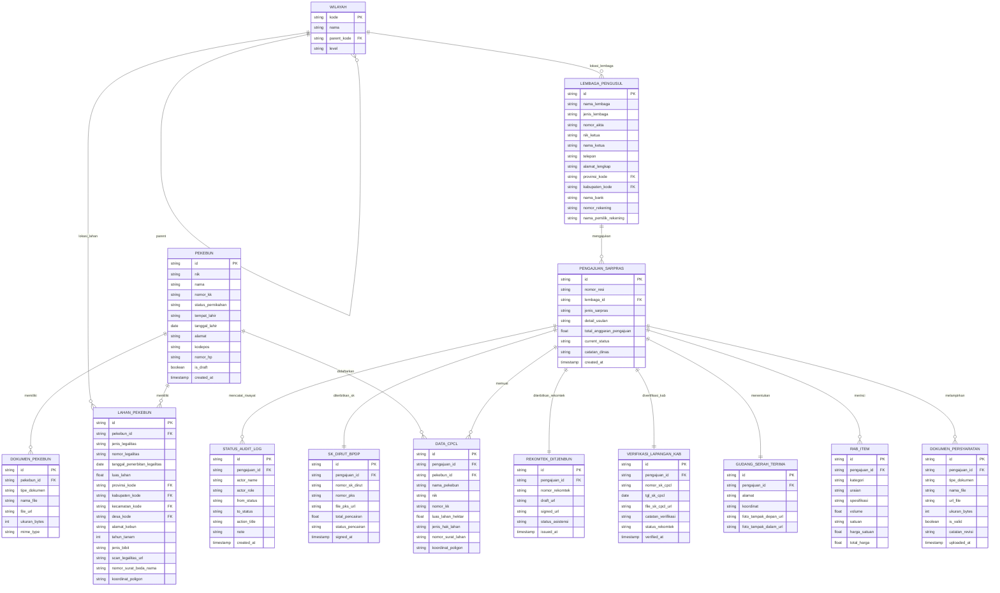

# 📊 Entity Relationship Diagram (ERD) — BPDP Sarpras Kelapa

Dokumen ini berisi spesifikasi arsitektur basis data (*database schema*) dan skrip import visual ERD untuk **Draw.io (diagrams.net)** pada sistem **BPDP Sarpras Kelapa**.

---

## 📖 Cara Generate / Import di Draw.io

### 🚀 Metode 1: Menggunakan Kode SQL DDL (Sangat Direkomendasikan)
Draw.io secara otomatis mengonversi perintah SQL `CREATE TABLE` menjadi tabel-tabel visual ERD yang rapi lengkap dengan *Primary Key* (PK), *Foreign Key* (FK), dan garis relasi.

1. Buka [draw.io](https://app.diagrams.net/).
2. Buat diagram baru atau buka kanvas kosong.
3. Di menu bagian atas, klik **Arrange** (atau **Menata**) ➡️ **Insert** (atau **Sisipkan**) ➡️ **Advanced** (atau **Tingkat Lanjut**) ➡️ **SQL**.
4. Salin (copy) seluruh kode pada bagian **[1. Script SQL DDL]** di bawah ini, lalu tempelkan (paste) ke dalam jendela input SQL di Draw.io.
5. Klik **Insert**. Draw.io akan otomatis menggambar ERD lengkap!

---

### 🎨 Metode 2: Menggunakan Kode Mermaid JS
1. Buka [draw.io](https://app.diagrams.net/).
2. Klik **Arrange** ➡️ **Insert** ➡️ **Advanced** ➡️ **Mermaid**.
3. Salin kode pada bagian **[2. Diagram Mermaid ERD]** di bawah ini.
4. Klik **Insert**.

---

## 📦 1. Script SQL DDL (Untuk Import SQL di Draw.io)

```sql
-- ============================================================
-- ERD SISTEM BPDP SARPRAS KELAPA
-- Import via: Arrange -> Insert -> Advanced -> SQL di Draw.io
-- ============================================================

CREATE TABLE wilayah (
    kode VARCHAR(20) PRIMARY KEY,
    nama VARCHAR(100) NOT NULL,
    parent_kode VARCHAR(20),
    level VARCHAR(20) NOT NULL,
    FOREIGN KEY (parent_kode) REFERENCES wilayah(kode)
);

CREATE TABLE lembaga_pengusul (
    id VARCHAR(36) PRIMARY KEY,
    nama_lembaga VARCHAR(150) NOT NULL,
    jenis_lembaga VARCHAR(30) NOT NULL,
    nomor_akta VARCHAR(100),
    nik_ketua VARCHAR(16) NOT NULL,
    nama_ketua VARCHAR(100) NOT NULL,
    telepon VARCHAR(20),
    alamat_lengkap TEXT,
    provinsi_kode VARCHAR(20),
    kabupaten_kode VARCHAR(20),
    nama_bank VARCHAR(50),
    nomor_rekening VARCHAR(50),
    nama_pemilik_rekening VARCHAR(100),
    FOREIGN KEY (provinsi_kode) REFERENCES wilayah(kode),
    FOREIGN KEY (kabupaten_kode) REFERENCES wilayah(kode)
);

CREATE TABLE pekebun (
    id VARCHAR(36) PRIMARY KEY,
    nik VARCHAR(16) UNIQUE NOT NULL,
    nama VARCHAR(100) NOT NULL,
    nomor_kk VARCHAR(16) NOT NULL,
    status_pernikahan VARCHAR(30),
    tempat_lahir VARCHAR(50),
    tanggal_lahir DATE,
    alamat TEXT,
    kodepos VARCHAR(10),
    nomor_hp VARCHAR(20),
    is_draft BOOLEAN DEFAULT FALSE,
    created_at TIMESTAMP DEFAULT CURRENT_TIMESTAMP
);

CREATE TABLE lahan_pekebun (
    id VARCHAR(36) PRIMARY KEY,
    pekebun_id VARCHAR(36) NOT NULL,
    jenis_legalitas VARCHAR(20) NOT NULL,
    nomor_legalitas VARCHAR(100) NOT NULL,
    tanggal_penerbitan_legalitas DATE,
    luas_lahan DECIMAL(10,2) NOT NULL,
    provinsi_kode VARCHAR(20),
    kabupaten_kode VARCHAR(20),
    kecamatan_kode VARCHAR(20),
    desa_kode VARCHAR(20),
    alamat_kebun TEXT,
    tahun_tanam INT,
    jenis_bibit VARCHAR(100),
    scan_legalitas_url VARCHAR(255),
    nomor_surat_beda_nama VARCHAR(100),
    koordinat_poligon TEXT,
    FOREIGN KEY (pekebun_id) REFERENCES pekebun(id),
    FOREIGN KEY (provinsi_kode) REFERENCES wilayah(kode),
    FOREIGN KEY (kabupaten_kode) REFERENCES wilayah(kode),
    FOREIGN KEY (kecamatan_kode) REFERENCES wilayah(kode),
    FOREIGN KEY (desa_kode) REFERENCES wilayah(kode)
);

CREATE TABLE dokumen_pekebun (
    id VARCHAR(36) PRIMARY KEY,
    pekebun_id VARCHAR(36) NOT NULL,
    tipe_dokumen VARCHAR(50) NOT NULL,
    nama_file VARCHAR(150) NOT NULL,
    file_url VARCHAR(255) NOT NULL,
    ukuran_bytes BIGINT,
    mime_type VARCHAR(50),
    FOREIGN KEY (pekebun_id) REFERENCES pekebun(id)
);

CREATE TABLE pengajuan_sarpras (
    id VARCHAR(36) PRIMARY KEY,
    nomor_resi VARCHAR(50) UNIQUE NOT NULL,
    lembaga_id VARCHAR(36) NOT NULL,
    jenis_sarpras VARCHAR(50) NOT NULL,
    detail_usulan TEXT,
    total_anggaran_pengajuan DECIMAL(15,2),
    current_status VARCHAR(50) NOT NULL,
    catatan_dinas TEXT,
    created_at TIMESTAMP DEFAULT CURRENT_TIMESTAMP,
    FOREIGN KEY (lembaga_id) REFERENCES lembaga_pengusul(id)
);

CREATE TABLE data_cpcl (
    id VARCHAR(36) PRIMARY KEY,
    pengajuan_id VARCHAR(36) NOT NULL,
    pekebun_id VARCHAR(36) NOT NULL,
    nama_pekebun VARCHAR(100),
    nik VARCHAR(16),
    nomor_kk VARCHAR(16),
    luas_lahan_hektar DECIMAL(10,2),
    jenis_hak_lahan VARCHAR(20),
    nomor_surat_lahan VARCHAR(100),
    koordinat_poligon TEXT,
    FOREIGN KEY (pengajuan_id) REFERENCES pengajuan_sarpras(id),
    FOREIGN KEY (pekebun_id) REFERENCES pekebun(id)
);

CREATE TABLE dokumen_persyaratan (
    id VARCHAR(36) PRIMARY KEY,
    pengajuan_id VARCHAR(36) NOT NULL,
    tipe_dokumen VARCHAR(50) NOT NULL,
    nama_file VARCHAR(150) NOT NULL,
    url_file VARCHAR(255) NOT NULL,
    ukuran_bytes BIGINT,
    is_valid BOOLEAN DEFAULT FALSE,
    catatan_revisi TEXT,
    uploaded_at TIMESTAMP DEFAULT CURRENT_TIMESTAMP,
    FOREIGN KEY (pengajuan_id) REFERENCES pengajuan_sarpras(id)
);

CREATE TABLE rab_item (
    id VARCHAR(36) PRIMARY KEY,
    pengajuan_id VARCHAR(36) NOT NULL,
    kategori VARCHAR(100),
    uraian VARCHAR(255) NOT NULL,
    spesifikasi VARCHAR(255),
    volume DECIMAL(10,2),
    satuan VARCHAR(30),
    harga_satuan DECIMAL(15,2),
    total_harga DECIMAL(15,2),
    FOREIGN KEY (pengajuan_id) REFERENCES pengajuan_sarpras(id)
);

CREATE TABLE gudang_serah_terima (
    id VARCHAR(36) PRIMARY KEY,
    pengajuan_id VARCHAR(36) UNIQUE NOT NULL,
    alamat TEXT,
    koordinat VARCHAR(100),
    foto_tampak_depan_url VARCHAR(255),
    foto_tampak_dalam_url VARCHAR(255),
    FOREIGN KEY (pengajuan_id) REFERENCES pengajuan_sarpras(id)
);

CREATE TABLE verifikasi_lapangan_kab (
    id VARCHAR(36) PRIMARY KEY,
    pengajuan_id VARCHAR(36) UNIQUE NOT NULL,
    nomor_sk_cpcl VARCHAR(100),
    tgl_sk_cpcl DATE,
    file_sk_cpcl_url VARCHAR(255),
    catatan_verifikasi TEXT,
    status_rekomtek VARCHAR(50),
    verified_at TIMESTAMP,
    FOREIGN KEY (pengajuan_id) REFERENCES pengajuan_sarpras(id)
);

CREATE TABLE rekomtek_ditjenbun (
    id VARCHAR(36) PRIMARY KEY,
    pengajuan_id VARCHAR(36) UNIQUE NOT NULL,
    nomor_rekomtek VARCHAR(100),
    draft_url VARCHAR(255),
    signed_url VARCHAR(255),
    status_asistensi VARCHAR(50),
    issued_at TIMESTAMP,
    FOREIGN KEY (pengajuan_id) REFERENCES pengajuan_sarpras(id)
);

CREATE TABLE sk_dirut_bpdp (
    id VARCHAR(36) PRIMARY KEY,
    pengajuan_id VARCHAR(36) UNIQUE NOT NULL,
    nomor_sk_dirut VARCHAR(100),
    nomor_pks VARCHAR(100),
    file_pks_url VARCHAR(255),
    total_pencairan DECIMAL(15,2),
    status_pencairan VARCHAR(50),
    signed_at TIMESTAMP,
    FOREIGN KEY (pengajuan_id) REFERENCES pengajuan_sarpras(id)
);

CREATE TABLE status_audit_log (
    id VARCHAR(36) PRIMARY KEY,
    pengajuan_id VARCHAR(36) NOT NULL,
    actor_name VARCHAR(100),
    actor_role VARCHAR(50),
    from_status VARCHAR(50),
    to_status VARCHAR(50),
    action_title VARCHAR(150),
    note TEXT,
    created_at TIMESTAMP DEFAULT CURRENT_TIMESTAMP,
    FOREIGN KEY (pengajuan_id) REFERENCES pengajuan_sarpras(id)
);
```

---

## 🎨 2. Diagram Mermaid ERD


