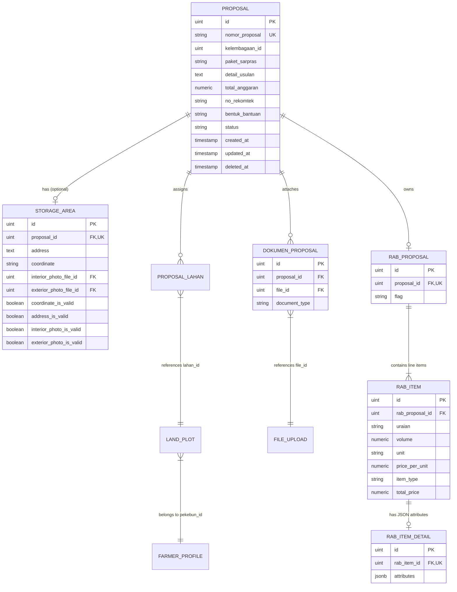
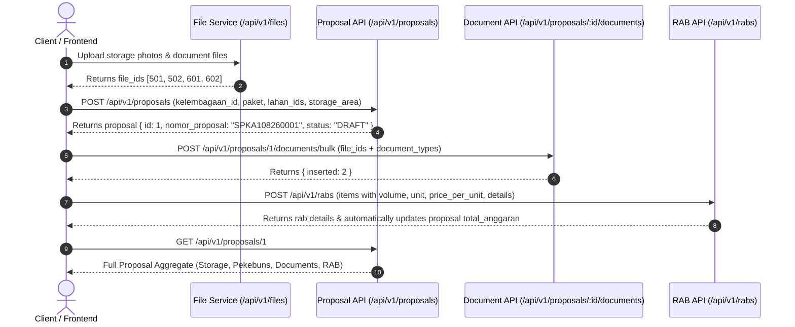

# BPDP Sarpras Kelapa - Proposal, Proposal Documents & RAB API Contract

This document serves as the comprehensive API specification and contract for the **Proposal Management**, **Proposal Documents**, and **Rencana Anggaran Biaya (RAB)** modules within the `bpdp-sarpras-kelapa-be` service.

---

## Table of Contents

1. [General Overview](#1-general-overview)
2. [Data Model & Architecture](#2-data-model--architecture)
3. [Standard Response & Error Formats](#3-standard-response--error-formats)
4. [Proposal API Endpoints](#4-proposal-api-endpoints)
   - [POST /api/v1/proposals](#41-create-proposal)
   - [GET /api/v1/proposals](#42-list-proposals)
   - [GET /api/v1/proposals/:id](#43-get-proposal-detail)
   - [PATCH /api/v1/proposals/:id](#44-update-proposal)
   - [DELETE /api/v1/proposals/:id](#45-delete-proposal)
   - [GET /api/v1/proposals/:id/spatial-overlap](#46-get-proposal-spatial-overlap)
5. [Proposal Documents API Endpoints](#5-proposal-documents-api-endpoints)
   - [GET /api/v1/proposals/:proposal_id/documents](#51-get-proposal-documents)
   - [POST /api/v1/proposals/:proposal_id/documents/bulk](#52-bulk-create-proposal-documents)
   - [PUT /api/v1/proposals/:proposal_id/documents](#53-bulk-sync-proposal-documents)
6. [Budget Plan (RAB) API Endpoints](#6-budget-plan-rab-api-endpoints)
   - [POST /api/v1/rabs](#61-create-budget-plan-rab)
   - [GET /api/v1/rabs/proposal/:proposal_id](#62-get-rab-by-proposal-id)
   - [PUT /api/v1/rabs/:id](#63-update-budget-plan-rab)
   - [DELETE /api/v1/rabs/:id](#64-delete-budget-plan-rab)
7. [End-to-End Workflow & Integration Guide](#7-end-to-end-workflow--integration-guide)
8. [Enums & Reference Data](#8-enums--reference-data)
9. [Farmer & Land Document Validation API Endpoints](#9-farmer--land-document-validation-api-endpoints)
   - [POST /api/v1/farmer-document-validations/bulk](#91-bulk-create-farmer-document-validations)
   - [POST /api/v1/land-document-validations/bulk](#92-bulk-create-land-document-validations)
10. [Proposal Document Validation API Endpoints](#10-proposal-document-validation-api-endpoints)
    - [POST /api/v1/proposal-document-validations](#101-create-or-upsert-proposal-document-validation)
    - [POST /api/v1/proposal-document-validations/bulk](#102-bulk-create-or-upsert-proposal-document-validations)
    - [GET /api/v1/proposal-document-validations](#103-list-proposal-document-validations)
    - [GET /api/v1/proposal-document-validations/:id](#104-get-proposal-document-validation-by-id)
    - [PUT /api/v1/proposal-document-validations/:id](#105-update-single-proposal-document-validation)
    - [PUT /api/v1/proposal-document-validations/bulk](#106-bulk-update-proposal-document-validations)
    - [DELETE /api/v1/proposal-document-validations/:id](#107-delete-proposal-document-validation)

---

## 1. General Overview

- **Base URL**: `http://localhost:8080/api/v1` (or server host environment)
- **Protocol**: HTTP/1.1, RESTful JSON
- **Default Headers**:
  - `Content-Type: application/json`
  - `Accept: application/json`
  - `Authorization: Bearer <jwt_token>` (when security middleware is active)
- **Timezone**: All timestamps are formatted as ISO 8601 strings with timezone offset (`2006-01-02T15:04:05Z07:00`).

---

## 2. Data Model & Architecture

The Proposal aggregate connects Kelembagaan, Land plots (`lahans`), Storage Area, Documents, and Budget Plans (RAB).



---

## 3. Standard Response & Error Formats

### 3.1 Single Object / Mutation Success Response (`200 OK`, `201 Created`)
```json
{
  "data": { ... },
  "message": "success"
}
```

### 3.2 Paginated List Response (`200 OK`)
```json
{
  "data": [ ... ],
  "meta": {
    "page": 1,
    "limit": 10,
    "total": 42
  }
}
```

### 3.3 Standard Error Response (`400`, `404`, `409`, `500`)
```json
{
  "error": {
    "code": "VALIDATION_ERROR",
    "message": "lahan_ids cannot be empty"
  }
}
```

#### Standard Error Codes:
| Code | HTTP Status | Description |
| :--- | :--- | :--- |
| `VALIDATION_ERROR` | `400 Bad Request` | Missing required fields, negative values, empty arrays, or malformed data |
| `NOT_FOUND` | `404 Not Found` | Requested resource (Proposal, RAB, Document, Lahan) does not exist |
| `CONFLICT` | `409 Conflict` | Land plot already assigned to another proposal, or RAB already exists for proposal |
| `INTERNAL_ERROR` | `500 Internal Server Error` | Database transaction error or unhandled backend failure |

---

## 4. Proposal API Endpoints

### 4.1 Create Proposal
Creates a new proposal aggregate, assigns land plots (`lahans`), and optionally creates a storage area within a single transaction.

- **Method**: `POST`
- **Path**: `/api/v1/proposals`
- **Content-Type**: `application/json`

#### Request Body
| Field | Type | Required | Description |
| :--- | :--- | :--- | :--- |
| `kelembagaan_id` | `uint` | **Yes** | ID of the farmer institution / cooperative |
| `paket_sarpras` | `string` | **Yes** | Sarpras package identifier/name (e.g. `"Paket 1"`) |
| `nomor_proposal` | `string` | No | Custom proposal number. If omitted or empty, generated as `SPKA<paket_digit><MM><YY><0001>` |
| `detail_usulan` | `string` | No | Detailed description of the proposal |
| `no_rekomtek` | `string` | No | Technical recommendation letter number |
| `bentuk_bantuan` | `string` | No | Form of assistance (e.g. `"Uang"`, `"Barang"`) |
| `lahan_ids` | `[]uint` | **Yes** | Array of valid, active land plot IDs (minimum 1, no duplicates, not assigned elsewhere) |
| `storage_area` | `object` | No | Optional storage area details |
| `storage_area.address` | `string` | No | Full address of storage area |
| `storage_area.coordinate` | `string` | No | GPS coordinates (e.g. `"-6.200000, 106.816666"`) |
| `storage_area.interior_photo_file_id` | `uint` | No | File ID of uploaded interior storage photo |
| `storage_area.exterior_photo_file_id` | `uint` | No | File ID of uploaded exterior storage photo |
| `storage_area.coordinate_is_valid` | `boolean` | No | Validation status of coordinates |
| `storage_area.address_is_valid` | `boolean` | No | Validation status of address |
| `storage_area.interior_photo_is_valid` | `boolean` | No | Validation status of interior photo |
| `storage_area.exterior_photo_is_valid` | `boolean` | No | Validation status of exterior photo |
| `storage_area.coordinate_notes` | `string` | No | Validation notes for coordinates |
| `storage_area.address_notes` | `string` | No | Validation notes for address |
| `storage_area.interior_photo_notes` | `string` | No | Validation notes for interior photo |
| `storage_area.exterior_photo_notes` | `string` | No | Validation notes for exterior photo |

#### Example Request
```json
{
  "kelembagaan_id": 12,
  "paket_sarpras": "Paket 1 - Peremajaan Kelapa Sawit/Kelapa Dalam",
  "detail_usulan": "Usulan bantuan sarana bibit dan pupuk untuk kelompok tani Makmur Jaya",
  "no_rekomtek": "REK/2026/08/001",
  "bentuk_bantuan": "Barang",
  "lahan_ids": [101, 102],
  "storage_area": {
    "address": "Jl. Raya Kebun Kelapa No. 45, Sambas",
    "coordinate": "-0.589123, 109.342111",
    "interior_photo_file_id": 501,
    "exterior_photo_file_id": 502
  }
}
```

#### Example Success Response (`201 Created`)
```json
{
  "data": {
    "id": 1,
    "nomor_proposal": "SPKA108260001",
    "status": "DRAFT"
  },
  "message": "success"
}
```

---

### 4.2 List Proposals
Retrieves a paginated list of proposals with search, filtering, and multi-field sorting.

- **Method**: `GET`
- **Path**: `/api/v1/proposals`

#### Query Parameters
| Parameter | Type | Default | Description |
| :--- | :--- | :--- | :--- |
| `page` | `int` | `1` | Page number |
| `limit` | `int` | `10` | Number of items per page (max: `100`) |
| `search` | `string` | `""` | Case-insensitive search on `nomor_proposal`, `paket_sarpras`, `no_rekomtek`, `detail_usulan` |
| `status` | `string` | `""` | Filter by proposal status (e.g. `DRAFT`, `SUBMITTED`, `VERIFIED`) |
| `start_date` | `string` | `""` | Filter by `created_at` start date (`YYYY-MM-DD`) |
| `end_date` | `string` | `""` | Filter by `created_at` end date (`YYYY-MM-DD`, inclusive through 23:59:59) |
| `sort_by` | `string` | `"id"` | Allowed: `id`, `nomor_proposal`, `paket_sarpras`, `total_anggaran`, `status`, `created_at`, `updated_at` |
| `sort_order` | `string` | `"desc"` | Sort direction: `asc` or `desc` |

#### Example Request
```http
GET /api/v1/proposals?page=1&limit=10&search=Makmur&status=DRAFT&sort_by=created_at&sort_order=desc HTTP/1.1
```

#### Example Success Response (`200 OK`)
```json
{
  "data": [
    {
      "id": 1,
      "nomor_proposal": "SPKA108260001",
      "kelembagaan_id": 12,
      "lembaga": {
        "id": 12,
        "namaLembaga": "Kelompok Tani Subur",
        "jenisLembaga": "POKTAN",
        "nomorAkta": "",
        "nikKetua": "3201010202750002",
        "namaKetua": "Sukirman",
        "telepon": "081234567891",
        "alamatLengkap": "Jl. Melati No.3, Cianjur",
        "kabupatenKode": "",
        "provinsiKode": "",
        "namaBank": "",
        "nomorRekening": "",
        "namaPemilikRekening": ""
      },
      "paket_sarpras": "Paket 1 - Peremajaan Kelapa Sawit/Kelapa Dalam",
      "detail_usulan": "Usulan bantuan sarana bibit dan pupuk untuk kelompok tani Makmur Jaya",
      "total_anggaran": 150000000,
      "no_rekomtek": "REK/2026/08/001",
      "bentuk_bantuan": "Barang",
      "status": "DRAFT",
      "created_at": "2026-08-24T09:00:00+07:00",
      "updated_at": "2026-08-24T09:30:00+07:00"
    }
  ],
  "meta": {
    "page": 1,
    "limit": 10,
    "total": 1
  }
}
```

---

### 4.3 Get Proposal Detail
Retrieves the complete aggregate of a proposal including:
- Storage area metadata and temporary presigned photo URLs.
- Deduplicated list of associated Pekebun (farmers) derived from assigned land plots, along with their identity documents and presigned file URLs.
- Attached proposal documents with presigned URLs.
- Attached RAB budget proposals, line items, and JSON attribute details.

- **Method**: `GET`
- **Path**: `/api/v1/proposals/:id`

#### Path Parameters
| Parameter | Type | Required | Description |
| :--- | :--- | :--- | :--- |
| `id` | `uint` | **Yes** | Proposal ID |

#### Example Success Response (`200 OK`)
```json
{
  "data": {
    "id": 1,
    "nomor_proposal": "SPKA108260001",
    "kelembagaan_id": 12,
    "lembaga": {
      "id": 12,
      "namaLembaga": "Kelompok Tani Subur",
      "jenisLembaga": "POKTAN",
      "nomorAkta": "",
      "nikKetua": "3201010202750002",
      "namaKetua": "Sukirman",
      "telepon": "081234567891",
      "alamatLengkap": "Jl. Melati No.3, Cianjur",
      "kabupatenKode": "",
      "provinsiKode": "",
      "namaBank": "",
      "nomorRekening": "",
      "namaPemilikRekening": ""
    },
    "paket_sarpras": "Paket 1 - Peremajaan Kelapa Sawit/Kelapa Dalam",
    "detail_usulan": "Usulan bantuan sarana bibit dan pupuk untuk kelompok tani Makmur Jaya",
    "total_anggaran": 150000000,
    "no_rekomtek": "REK/2026/08/001",
    "bentuk_bantuan": "Barang",
    "status": "DRAFT",
    "storage_area": {
      "id": 1,
      "address": "Jl. Raya Kebun Kelapa No. 45, Sambas",
      "coordinate": "-0.589123, 109.342111",
      "interior_photo_file_id": 501,
      "interior_photo_file_url": "https://minio.example.com/sarpras/int_501.jpg?X-Amz-Expires=900...",
      "exterior_photo_file_id": 502,
      "exterior_photo_file_url": "https://minio.example.com/sarpras/ext_502.jpg?X-Amz-Expires=900...",
      "coordinate_is_valid": null,
      "address_is_valid": null,
      "interior_photo_is_valid": null,
      "exterior_photo_is_valid": null,
      "coordinate_notes": null,
      "address_notes": null,
      "interior_photo_notes": null,
      "exterior_photo_notes": null
    },
    "pekebuns": [
      {
        "id": 8,
        "kelembagaan_id": "12",
        "nik": "6101012345670001",
        "name": "Ahmad Dahlan",
        "nomor_kk": "6101012345670002",
        "marriage_status": "MENIKAH",
        "place_of_birth": "Sambas",
        "date_of_birth": "1982-07-14",
        "address": "Dusun Melati RT 02 RW 01 Desa Sukabumi",
        "postcode": "79462",
        "phone_number": "081234567890",
        "is_draft": false,
        "created_at": "2026-08-20T10:00:00+07:00",
        "updated_at": "2026-08-20T10:00:00+07:00",
        "documents": [
          {
            "id": 10,
            "document_type": "KTP",
            "file_name": "ktp_ahmad.pdf",
            "file_url": "https://minio.example.com/sarpras/ktp.pdf?X-Amz-Expires=900...",
            "file_size": "1048576",
            "file_extension": "pdf",
            "mime_type": "application/pdf",
            "created_at": "2026-08-20T10:05:00+07:00"
          }
        ]
      }
    ],
    "documents": [
      {
        "id": 1,
        "proposal_id": 1,
        "file_id": 601,
        "document_type": "SURAT_PERMOHONAN",
        "file_name": "surat_permohonan.pdf",
        "file_url": "https://minio.example.com/sarpras/surat.pdf?X-Amz-Expires=900...",
        "file_size": "2048000",
        "file_extension": "pdf",
        "mime_type": "application/pdf",
        "created_at": "2026-08-24T09:15:00+07:00",
        "updated_at": "2026-08-24T09:15:00+07:00"
      }
    ],
    "rabs": [
      {
        "id": 1,
        "proposal_id": 1,
        "flag": "PROPOSAL",
        "items": [
          {
            "id": 1,
            "rab_proposal_id": 1,
            "uraian": "Pengadaan Bibit Kelapa Dalam Unggul",
            "volume": 1000,
            "unit": "Batang",
            "price_per_unit": 75000,
            "item_type": "BARANG",
            "total_price": 75000000,
            "details": {
              "spesifikasi": "Sertifikasi Unggul Balit Palma",
              "varietas": "Kelapa Dalam Sambas"
            }
          },
          {
            "id": 2,
            "rab_proposal_id": 1,
            "uraian": "Pupuk NPK & Organik Granul",
            "volume": 5000,
            "unit": "Kg",
            "price_per_unit": 15000,
            "item_type": "BARANG",
            "total_price": 75000000,
            "details": {
              "merk": "Pupuk Indonesia",
              "formula": "15-15-15"
            }
          }
        ],
        "created_at": "2026-08-24T09:30:00+07:00",
        "updated_at": "2026-08-24T09:30:00+07:00"
      }
    ],
    "created_at": "2026-08-24T09:00:00+07:00",
    "updated_at": "2026-08-24T09:30:00+07:00"
  },
  "message": "success"
}
```

---

### 4.4 Update Proposal
Performs a partial update on proposal metadata, updates/replaces assigned lands (`lahan_ids`), and creates, updates, or deletes the storage area.

- **Method**: `PATCH`
- **Path**: `/api/v1/proposals/:id`
- **Content-Type**: `application/json`

#### Special Update Rules:
- If `"storage_area": null` is explicitly passed in the JSON payload, the associated storage area is deleted.
- If `"storage_area": { ... }` is passed, the existing storage area is updated (or created if absent).
- If `"lahan_ids": [ ... ]` is passed, the assigned land plots are replaced with the provided list (validates existence and conflict availability).

#### Example Request
```json
{
  "paket_sarpras": "Paket 1 - Peremajaan Kelapa Sawit/Kelapa Dalam (Revisi)",
  "detail_usulan": "Revisi penambahan alokasi pupuk dan luas lahan",
  "no_rekomtek": "REK/2026/08/001-REV",
  "bentuk_bantuan": "Barang",
  "status": "SUBMITTED",
  "lahan_ids": [101, 102, 103],
  "storage_area": {
    "address": "Jl. Raya Kebun Kelapa No. 45A, Sambas",
    "coordinate": "-0.589150, 109.342200",
    "interior_photo_file_id": 503,
    "exterior_photo_file_id": 504
  }
}
```

#### Example Success Response (`200 OK`)
Returns the complete updated `ProposalDetailResponse` object.

---

### 4.5 Delete Proposal
Soft-deletes a proposal by recording the `deleted_at` timestamp. Child relations (`storage_areas`, `dokumen_proposals`, `rab_proposals`) are preserved in DB but isolated from active queries.

- **Method**: `DELETE`
- **Path**: `/api/v1/proposals/:id`

#### Path Parameters
| Parameter | Type | Required | Description |
| :--- | :--- | :--- | :--- |
| `id` | `uint` | **Yes** | Proposal ID |

#### Example Success Response (`200 OK`)
```json
{
  "data": {
    "id": 1,
    "deleted": true
  },
  "message": "success"
}
```

### 4.6 Get Proposal Spatial Overlap
Retrieves spatial polygon coordinates associated with the active proposal's land plots and all other proposals' land plots situated within 50 km (50000 meters) to detect boundaries overlaps.

- **Method**: `GET`
- **Path**: `/api/v1/proposals/:id/spatial-overlap`

#### Path Parameters
| Parameter | Type | Required | Description |
| :--- | :--- | :--- | :--- |
| `id` | `uint` | **Yes** | Proposal ID |

#### Example Success Response (`200 OK`)
```json
{
  "data": {
    "active_polygons": [
      {
        "coordinates": [
          [-6.200000, 106.800000],
          [-6.200000, 106.810000],
          [-6.210000, 106.810000],
          [-6.210000, 106.800000]
        ],
        "label": "Sutrisno"
      }
    ],
    "other_proposals": [
      {
        "proposalId": 2,
        "proposalNumber": "PROP/2026/08/0002",
        "proposalName": "Kelompok Tani Subur",
        "polygons": [
          {
            "coordinates": [
              [-6.220000, 106.820000],
              [-6.220000, 106.830000],
              [-6.230000, 106.830000],
              [-6.230000, 106.820000]
            ],
            "label": "Sukirman"
          }
        ]
      }
    ]
  },
  "message": "success"
}
```

---

## 5. Proposal Documents API Endpoints

### 5.1 Get Proposal Documents
Retrieves all document attachments for a proposal with active presigned download URLs.

- **Method**: `GET`
- **Path**: `/api/v1/proposals/:proposal_id/documents`

#### Path Parameters
| Parameter | Type | Required | Description |
| :--- | :--- | :--- | :--- |
| `proposal_id` | `uint` | **Yes** | Proposal ID |

#### Example Success Response (`200 OK`)
```json
{
  "data": [
    {
      "id": 1,
      "proposal_id": 1,
      "file_id": 601,
      "document_type": "SURAT_PERMOHONAN",
      "file_name": "surat_permohonan.pdf",
      "file_url": "https://minio.example.com/sarpras/surat.pdf?X-Amz-Expires=900...",
      "file_size": "2048000",
      "file_extension": "pdf",
      "mime_type": "application/pdf",
      "created_at": "2026-08-24T09:15:00+07:00",
      "updated_at": "2026-08-24T09:15:00+07:00"
    }
  ],
  "message": "success"
}
```

---

### 5.2 Bulk Create Proposal Documents
Attaches multiple uploaded files to a proposal in a single database transaction. Document types are automatically capitalized.

- **Method**: `POST`
- **Path**: `/api/v1/proposals/:proposal_id/documents/bulk`
- **Content-Type**: `application/json`

#### Validation Rules:
- `documents` array must not be empty.
- `file_id` must reference an existing and active file record.
- `document_type` cannot be blank or duplicated within the request.

#### Example Request
```json
{
  "documents": [
    {
      "file_id": 601,
      "document_type": "SURAT_PERMOHONAN"
    },
    {
      "file_id": 602,
      "document_type": "DOKUMEN_LEGALITAS_KELEMBAGAAN"
    },
    {
      "file_id": 603,
      "document_type": "SURAT_PERNYATAAN_KEABSAHAN"
    }
  ]
}
```

#### Example Success Response (`201 Created`)
```json
{
  "data": {
    "inserted": 3
  },
  "message": "success"
}
```

---

### 5.3 Bulk Sync Proposal Documents
Performs full synchronization (upsert + delete omitted) of proposal documents for the given proposal:
- **Inserts** new document types not previously attached.
- **Updates** `file_id` for existing document types.
- **Deletes** document attachments whose types are not included in the payload.

- **Method**: `PUT`
- **Path**: `/api/v1/proposals/:proposal_id/documents`
- **Content-Type**: `application/json`

#### Example Request
```json
{
  "documents": [
    {
      "file_id": 604,
      "document_type": "SURAT_PERMOHONAN"
    },
    {
      "file_id": 602,
      "document_type": "DOKUMEN_LEGALITAS_KELEMBAGAAN"
    }
  ]
}
```

#### Example Success Response (`200 OK`)
```json
{
  "data": [
    {
      "id": 1,
      "proposal_id": 1,
      "file_id": 604,
      "document_type": "SURAT_PERMOHONAN",
      "file_name": "surat_permohonan_v2.pdf",
      "file_url": "https://minio.example.com/sarpras/surat_v2.pdf?X-Amz-Expires=900...",
      "file_size": "2150000",
      "file_extension": "pdf",
      "mime_type": "application/pdf",
      "created_at": "2026-08-24T09:15:00+07:00",
      "updated_at": "2026-08-24T10:15:00+07:00"
    },
    {
      "id": 2,
      "proposal_id": 1,
      "file_id": 602,
      "document_type": "DOKUMEN_LEGALITAS_KELEMBAGAAN",
      "file_name": "legalitas.pdf",
      "file_url": "https://minio.example.com/sarpras/legalitas.pdf?X-Amz-Expires=900...",
      "file_size": "4194304",
      "file_extension": "pdf",
      "mime_type": "application/pdf",
      "created_at": "2026-08-24T09:15:00+07:00",
      "updated_at": "2026-08-24T09:15:00+07:00"
    }
  ],
  "message": "success"
}
```

---

## 6. Budget Plan (RAB) API Endpoints

### 6.1 Create Budget Plan (RAB)
Creates a Budget Plan (`rab_proposals`) with line items (`rab_items`) and dynamic JSON attributes (`rab_item_details`). Automatically computes `total_price = volume * price_per_unit` for each item and updates the parent proposal's `total_anggaran` in a single transaction.

- **Method**: `POST`
- **Path**: `/api/v1/rabs`
- **Content-Type**: `application/json`

#### Validation Rules:
- Only **1 RAB** is permitted per proposal (`409 Conflict` if RAB already exists).
- `proposal_id`: Required, must reference an existing active proposal.
- `items`: Required array, minimum 1 item.
- `items[].uraian`: Required non-empty string.
- `items[].volume`: Required numeric `> 0`.
- `items[].unit`: Required non-empty string (e.g. `"Batang"`, `"Kg"`, `"Paket"`, `"Unit"`).
- `items[].price_per_unit`: Required numeric `>= 0`.
- `items[].item_type`: Required non-empty string (e.g. `"BARANG"`, `"JASA"`).
- `items[].details`: Optional JSON object for arbitrary dynamic fields (stored as `jsonb`).
- `flag`: Optional string, defaults to `"PROPOSAL"`.

#### Example Request
```json
{
  "proposal_id": 1,
  "flag": "PROPOSAL",
  "items": [
    {
      "uraian": "Pengadaan Bibit Kelapa Dalam Unggul",
      "volume": 1000,
      "unit": "Batang",
      "price_per_unit": 75000,
      "item_type": "BARANG",
      "details": {
        "spesifikasi": "Sertifikasi Unggul Balit Palma",
        "varietas": "Kelapa Dalam Sambas"
      }
    },
    {
      "uraian": "Pupuk NPK & Organik Granul",
      "volume": 5000,
      "unit": "Kg",
      "price_per_unit": 15000,
      "item_type": "BARANG",
      "details": {
        "merk": "Pupuk Indonesia",
        "formula": "15-15-15"
      }
    }
  ]
}
```

#### Example Success Response (`201 Created`)
```json
{
  "data": {
    "id": 1,
    "proposal_id": 1,
    "flag": "PROPOSAL",
    "items": [
      {
        "id": 1,
        "rab_proposal_id": 1,
        "uraian": "Pengadaan Bibit Kelapa Dalam Unggul",
        "volume": 1000,
        "unit": "Batang",
        "price_per_unit": 75000,
        "item_type": "BARANG",
        "total_price": 75000000,
        "details": {
          "spesifikasi": "Sertifikasi Unggul Balit Palma",
          "varietas": "Kelapa Dalam Sambas"
        }
      },
      {
        "id": 2,
        "rab_proposal_id": 1,
        "uraian": "Pupuk NPK & Organik Granul",
        "volume": 5000,
        "unit": "Kg",
        "price_per_unit": 15000,
        "item_type": "BARANG",
        "total_price": 75000000,
        "details": {
          "merk": "Pupuk Indonesia",
          "formula": "15-15-15"
        }
      }
    ],
    "created_at": "2026-08-24T09:30:00+07:00",
    "updated_at": "2026-08-24T09:30:00+07:00"
  },
  "message": "success"
}
```

---

### 6.2 Get RAB by Proposal ID
Retrieves the complete RAB structure associated with a specific proposal.

- **Method**: `GET`
- **Path**: `/api/v1/rabs/proposal/:proposal_id`

#### Path Parameters
| Parameter | Type | Required | Description |
| :--- | :--- | :--- | :--- |
| `proposal_id` | `uint` | **Yes** | Proposal ID |

#### Example Success Response (`200 OK`)
Returns the `RabResponse` object matching the structure from [POST /api/v1/rabs](#61-create-budget-plan-rab).

---

### 6.3 Update Budget Plan (RAB)
Replaces line items in an existing RAB, recomputes item line totals, and synchronizes the aggregated sum into the parent proposal's `total_anggaran`.

- **Method**: `PUT`
- **Path**: `/api/v1/rabs/:id`
- **Content-Type**: `application/json`

#### Path Parameters
| Parameter | Type | Required | Description |
| :--- | :--- | :--- | :--- |
| `id` | `uint` | **Yes** | RAB ID |

#### Example Request
```json
{
  "flag": "PROPOSAL_REVISI",
  "items": [
    {
      "uraian": "Pengadaan Bibit Kelapa Dalam Unggul (Penyesuaian)",
      "volume": 1200,
      "unit": "Batang",
      "price_per_unit": 75000,
      "item_type": "BARANG",
      "details": {
        "spesifikasi": "Sertifikasi Unggul Balit Palma",
        "alasan_revisi": "Penambahan kuota pekebun"
      }
    }
  ]
}
```

#### Example Success Response (`200 OK`)
```json
{
  "data": {
    "id": 1,
    "proposal_id": 1,
    "flag": "PROPOSAL_REVISI",
    "items": [
      {
        "id": 3,
        "rab_proposal_id": 1,
        "uraian": "Pengadaan Bibit Kelapa Dalam Unggul (Penyesuaian)",
        "volume": 1200,
        "unit": "Batang",
        "price_per_unit": 75000,
        "item_type": "BARANG",
        "total_price": 90000000,
        "details": {
          "spesifikasi": "Sertifikasi Unggul Balit Palma",
          "alasan_revisi": "Penambahan kuota pekebun"
        }
      }
    ],
    "created_at": "2026-08-24T09:30:00+07:00",
    "updated_at": "2026-08-24T11:00:00+07:00"
  },
  "message": "success"
}
```

---

### 6.4 Delete Budget Plan (RAB)
Deletes the RAB, cascades deletion to all line items and dynamic details, and resets the parent proposal's `total_anggaran` to `0`.

- **Method**: `DELETE`
- **Path**: `/api/v1/rabs/:id`

#### Path Parameters
| Parameter | Type | Required | Description |
| :--- | :--- | :--- | :--- |
| `id` | `uint` | **Yes** | RAB ID |

#### Example Success Response (`200 OK`)
```json
{
  "data": {
    "id": 1,
    "deleted": true
  },
  "message": "success"
}
```

---

## 7. End-to-End Workflow & Integration Guide

Here is the standard workflow for frontend / client applications to submit a proposal:



---

## 8. Enums & Reference Data

### 8.1 Proposal Status (`status`)
| Status | Description |
| :--- | :--- |
| `DRAFT` | Initial draft proposal, editable by farmer institution |
| `SUBMITTED` | Submitted to verifier / Dinas for review |
| `VERIFIED` | Verified by field / technical verifiers |
| `APPROVED` | Approved for funding by BPDPKS |
| `REJECTED` | Rejected or returned for revisions |

### 8.2 Document Types (`document_type`)
| Key | Document Title | Description |
| :--- | :--- | :--- |
| `SURAT_PERMOHONAN` | Surat Permohonan Bantuan | Formal application letter from institution |
| `DOKUMEN_LEGALITAS_KELEMBAGAAN` | Legalitas Kelembagaan | Institution legal deed / SK Kemenkumham |
| `SURAT_PERNYATAAN_KEABSAHAN` | Surat Pernyataan Keabsahan | Statement letter of data accuracy |
| `PROPOSAL_TEKNIS` | Proposal Teknis | Detailed technical proposal document |
| `SPTJM` | SPTJM | Surat Pernyataan Tanggung Jawab Mutlak |
| `DOKUMEN_PENDUKUNG` | Dokumen Pendukung Lainnya | Miscellaneous supplementary files |

### 8.3 RAB Item Types (`item_type`)
| Type | Description |
| :--- | :--- |
| `BARANG` | Physical goods (seeds, fertilizers, pesticides, agricultural machinery) |
| `JASA` | Services (labor, land preparation, technical training, transportation) |
| `LAINNYA` | Other budgeted expenditure items |

### 8.4 RAB Flags (`flag`)
| Flag | Description |
| :--- | :--- |
| `PROPOSAL` | Original budget proposed by the cooperative |
| `VERIFIKASI` | Adjusted budget after technical team verification |
| `REKOMTEK` | Budget approved under technical recommendation |
| `FINAL` | Final approved budget for disbursement |

---

## 9. Farmer & Land Document Validation API Endpoints

### 9.1 Bulk Create Farmer Document Validations
Atomically records verification statuses for multiple farmer profiles and their individual identity fields (Nama Lengkap, NIK, KK).

- **Method**: `POST`
- **Path**: `/api/v1/farmer-document-validations/bulk`

#### Request Payload (`application/json`)
```json
[
  {
    "dokumen_pekebun_id": 101,
    "pengajuan_id": 12,
    "is_valid": true,
    "notes": "Data KTP sesuai",
    "details": [
      {
        "field_name": "namaLengkap",
        "is_valid": true
      },
      {
        "field_name": "nik",
        "is_valid": true
      }
    ]
  }
]
```

#### Response Payload (`201 Created`)
```json
{
  "data": [
    {
      "id": 5,
      "dokumen_pekebun_id": 101,
      "pengajuan_id": 12,
      "is_valid": true,
      "notes": "Data KTP sesuai",
      "validated_at": "2026-08-27T16:00:00Z"
    }
  ],
  "message": "success"
}
```

### 9.2 Bulk Create Land Document Validations
Atomically records verification statuses for land plot documents.

- **Method**: `POST`
- **Path**: `/api/v1/land-document-validations/bulk`

#### Request Payload (`application/json`)
```json
[
  {
    "dokumen_lahan_id": 201,
    "pengajuan_id": 12,
    "is_valid": true,
    "notes": ""
  }
]
```

#### Response Payload (`201 Created`)
```json
{
  "data": [
    {
      "id": 8,
      "dokumen_lahan_id": 201,
      "pengajuan_id": 12,
      "is_valid": true,
      "notes": "",
      "validated_at": "2026-08-27T16:00:00Z"
    }
  ],
  "message": "success"
}
```

---

## 10. Proposal Document Validation API Endpoints

Endpoints for validating proposal-level documents (such as institutional files, applications, and RABs) individually and in bulk.

### 10.1 Create or Upsert Proposal Document Validation
Create or update a validation status for a single proposal document.

- **Method**: `POST`
- **Path**: `/api/v1/proposal-document-validations`

#### Request Payload (`application/json`)
```json
{
  "dokumen_proposal_id": 1,
  "is_valid": true,
  "notes": "Verified successfully"
}
```

#### Response Payload (`201 Created`)
```json
{
  "data": {
    "id": 1,
    "dokumen_proposal_id": 1,
    "is_valid": true,
    "notes": "Verified successfully",
    "created_by": null,
    "validated_at": "2026-08-28T11:00:00Z",
    "created_at": "2026-08-28T11:00:00Z",
    "updated_at": "2026-08-28T11:00:00Z"
  },
  "message": "success"
}
```

---

### 10.2 Bulk Create or Upsert Proposal Document Validations
Atomically record or update validation statuses for multiple proposal documents within a single database transaction.

- **Method**: `POST`
- **Path**: `/api/v1/proposal-document-validations/bulk`

#### Request Payload (`application/json`)
```json
[
  {
    "dokumen_proposal_id": 1,
    "is_valid": true,
    "notes": "Verified"
  },
  {
    "dokumen_proposal_id": 2,
    "is_valid": false,
    "notes": "Invalid signatures"
  }
]
```

#### Response Payload (`201 Created`)
```json
{
  "data": [
    {
      "id": 1,
      "dokumen_proposal_id": 1,
      "is_valid": true,
      "notes": "Verified",
      "created_by": null,
      "validated_at": "2026-08-28T11:00:00Z",
      "created_at": "2026-08-28T11:00:00Z",
      "updated_at": "2026-08-28T11:00:00Z"
    },
    {
      "id": 2,
      "dokumen_proposal_id": 2,
      "is_valid": false,
      "notes": "Invalid signatures",
      "created_by": null,
      "validated_at": "2026-08-28T11:00:00Z",
      "created_at": "2026-08-28T11:00:00Z",
      "updated_at": "2026-08-28T11:00:00Z"
    }
  ],
  "message": "success"
}
```

---

### 10.3 List Proposal Document Validations
Retrieve a paginated list of proposal document validation records, with support for filtering by proposal, specific documents, and validity status.

- **Method**: `GET`
- **Path**: `/api/v1/proposal-document-validations`

#### Query Parameters
- `page` *(integer, optional, default: 1)*
- `limit` *(integer, optional, default: 10)*
- `proposal_id` *(integer, optional)*: Filter by proposal ID.
- `dokumen_proposal_id` *(integer, optional)*: Filter by proposal document ID.
- `is_valid` *(boolean, optional)*: Filter by validation status.

#### Response Payload (`200 OK`)
```json
{
  "data": [
    {
      "id": 1,
      "dokumen_proposal_id": 1,
      "is_valid": true,
      "notes": "Verified",
      "created_by": null,
      "validated_at": "2026-08-28T11:00:00Z",
      "created_at": "2026-08-28T11:00:00Z",
      "updated_at": "2026-08-28T11:00:00Z"
    }
  ],
  "meta": {
    "page": 1,
    "limit": 10,
    "total": 1
  }
}
```

---

### 10.4 Get Proposal Document Validation by ID
Retrieve details of a specific validation record.

- **Method**: `GET`
- **Path**: `/api/v1/proposal-document-validations/:id`

#### Response Payload (`200 OK`)
```json
{
  "data": {
    "id": 1,
    "dokumen_proposal_id": 1,
    "is_valid": true,
    "notes": "Verified",
    "created_by": null,
    "validated_at": "2026-08-28T11:00:00Z",
    "created_at": "2026-08-28T11:00:00Z",
    "updated_at": "2026-08-28T11:00:00Z"
  },
  "message": "success"
}
```

---

### 10.5 Update Single Proposal Document Validation
Update validation status or notes of a specific record.

- **Method**: `PUT`
- **Path**: `/api/v1/proposal-document-validations/:id`

#### Request Payload (`application/json`)
```json
{
  "is_valid": true,
  "notes": "Revised after verification"
}
```

#### Response Payload (`200 OK`)
```json
{
  "data": {
    "id": 1,
    "dokumen_proposal_id": 1,
    "is_valid": true,
    "notes": "Revised after verification",
    "created_by": null,
    "validated_at": "2026-08-28T11:00:00Z",
    "created_at": "2026-08-28T11:00:00Z",
    "updated_at": "2026-08-28T11:00:00Z"
  },
  "message": "success"
}
```

---

### 10.6 Bulk Update Proposal Document Validations
Atomically update multiple existing validation records.

- **Method**: `PUT`
- **Path**: `/api/v1/proposal-document-validations/bulk`

#### Request Payload (`application/json`)
```json
[
  {
    "id": 1,
    "is_valid": true,
    "notes": "Acceptable now"
  }
]
```

#### Response Payload (`200 OK`)
```json
{
  "data": [
    {
      "id": 1,
      "dokumen_proposal_id": 1,
      "is_valid": true,
      "notes": "Acceptable now",
      "created_by": null,
      "validated_at": "2026-08-28T11:00:00Z",
      "created_at": "2026-08-28T11:00:00Z",
      "updated_at": "2026-08-28T11:00:00Z"
    }
  ],
  "message": "success"
}
```

---

### 10.7 Delete Proposal Document Validation
Soft delete a validation record.

- **Method**: `DELETE`
- **Path**: `/api/v1/proposal-document-validations/:id`

#### Response Payload (`200 OK`)
```json
{
  "data": null,
  "message": "success"
}
```

