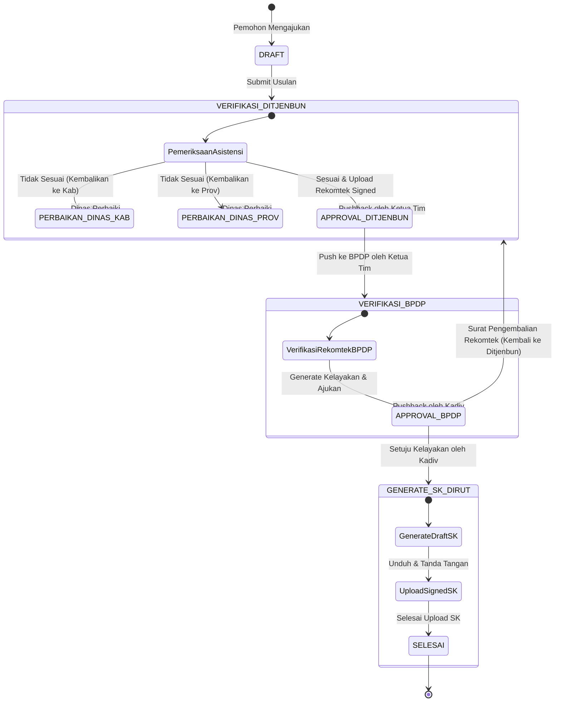

# Data Model & State Transitions: Verifikasi Rekomtek & SK Dirut

## Domain Models (TypeScript Interfaces)

Berikut adalah definisi tipe data dan model entitas yang akan diimplementasikan di store `src/stores/rekomtek.ts`:

```typescript
export type UsulanStatus =
  | 'DRAFT'
  | 'VERIFIKASI_DITJENBUN'
  | 'PERBAIKAN_DINAS_KAB'
  | 'PERBAIKAN_DINAS_PROV'
  | 'APPROVAL_DITJENBUN'
  | 'VERIFIKASI_BPDP'
  | 'APPROVAL_BPDP'
  | 'GENERATE_SK_DIRUT'
  | 'SELESAI';

export type BantuanType = 'UANG' | 'BARANG';

export interface StatusLog {
  id: string;
  usulanId: string;
  fromStatus: UsulanStatus;
  toStatus: UsulanStatus;
  actorName: string;
  actorRole: 'VERIFIKATOR_DITJENBUN' | 'APPROVAL_DITJENBUN' | 'VERIFIKATOR_BPDP' | 'APPROVAL_BPDP' | 'SYSTEM';
  note: string; // Alasan pengembalian/penolakan atau catatan aksi
  createdAt: string;
}

export interface UsulanRekomtek {
  id: string;
  nomorUsulan: string;
  namaKelompokTani: string;
  komoditas: string;
  status: UsulanStatus;
  bantuanType?: BantuanType;
  createdAt: string;
  updatedAt: string;
  
  // Asistensi Ditjenbun
  asistensiChecklist?: {
    skCpcl: boolean;
    suratPengantarProv: boolean;
    dataPekebun: boolean;
    dataLahan: boolean;
    dataKelembagaan: boolean;
    catatan?: string;
  };

  // Rekomtek Dokumen (Ditjenbun)
  rekomtek?: {
    nomorRekomtek: string;
    draftUrl?: string;
    signedUrl?: string;
    uploadedAt?: string;
  };

  // Verifikasi BPDP
  bpdpChecklist?: {
    rekomtek: boolean;
    skCpcl: boolean;
    suratPengantarProv: boolean;
    beritaAcaraVerifikasi: boolean;
    catatan?: string;
  };

  // Kelayakan Rekomtek Dokumen (BPDP)
  kelayakan?: {
    statusKelayakan: 'LAYAK' | 'TIDAK_LAYAK';
    draftUrl?: string;
    isSubmitted: boolean;
    createdAt?: string;
  };

  // SK Dirut Dokumen (BPDP)
  skDirut?: {
    nomorSk?: string;
    draftUrl?: string;
    signedUrl?: string;
    uploadedAt?: string;
  };

  logs?: StatusLog[];
}
```

## Daur Hidup & Transisi Status (State Transition Lifecycle)

Proses status usulan sarpras kakao berjalan satu arah dengan opsi pengembalian (*pushback* atau *return*) sebagai berikut:



## Aturan Validasi Formulir (Form Validation Rules)

### 1. Form Pengembalian Proposal (Ditjenbun)
* **Tujuan Pengembalian** (`tujuan`): Wajib dipilih (`Dinas Kabupaten/Kota` atau `Dinas Provinsi`).
* **Alasan Ketidaksesuaian** (`alasan`): Wajib diisi, minimal 10 karakter untuk menjamin kejelasan perbaikan bagi dinas daerah.

### 2. Form Penerbitan Rekomtek (Ditjenbun)
* **Bentuk Bantuan** (`bantuanType`): Wajib dipilih (`UANG` atau `BARANG`).
* **Nomor Rekomtek** (`nomorRekomtek`): Wajib diisi dengan format string alfabetis & numerik.
* **Unggahan Rekomtek Signed** (`rekomtekFile`): Wajib diunggah, format file harus `.pdf` dengan ukuran maksimal 10MB.

### 3. Form Asistensi/Checking Berkas (Ditjenbun & BPDP)
* Seluruh item checklist dokumen wajib ditandai kesesuaiannya (`true`/`false`) sebelum tombol simpan/aksi lanjutan aktif.

### 4. Form Checklist Kelayakan Rekomtek (BPDP)
* **Status Kelayakan** (`statusKelayakan`): Harus menghasilkan kesimpulan (`LAYAK` atau `TIDAK_LAYAK`) berdasarkan isian checklist dokumen utama.

### 5. Form Upload SK Dirut (BPDP)
* **File SK Dirut Signed** (`skDirutFile`): Wajib diunggah, format file `.pdf` dengan ukuran maksimal 10MB.
