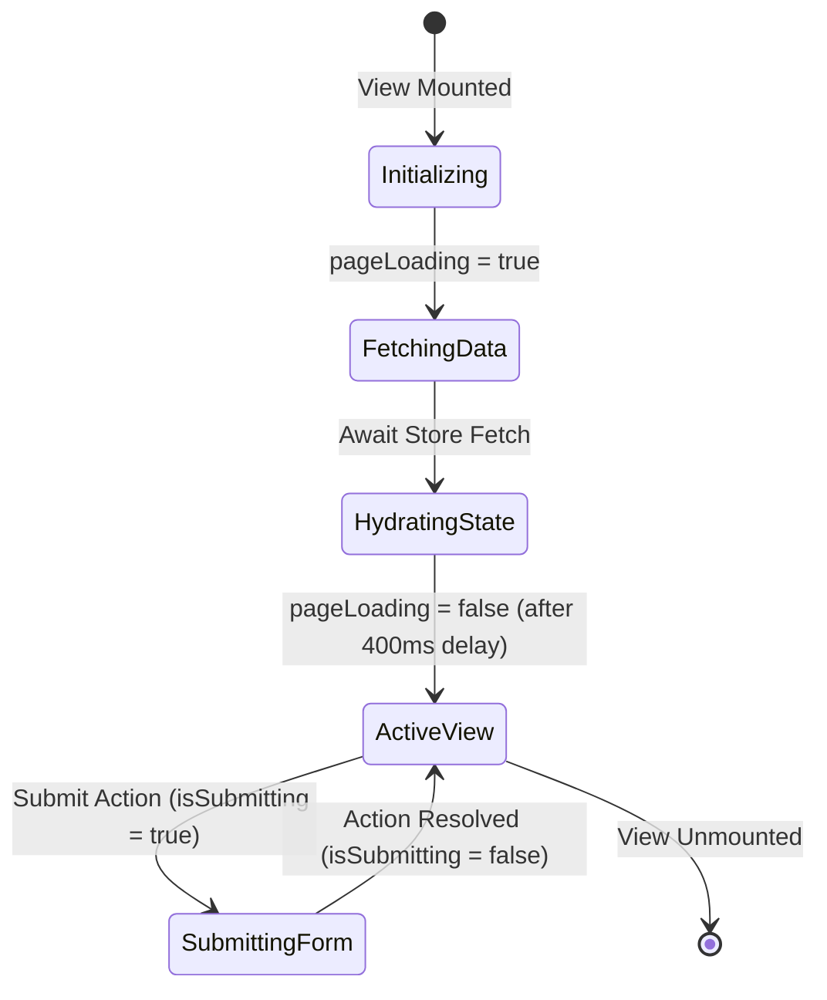

# Page State Schema: Skeleton Loading Coverage

This document outlines the state structure used by the page views to orchestrate and handle loading lifecycle states.

## View State Model

Each target view utilizes a standardized component-level local state shape to govern loading behavior:

```typescript
interface ViewState {
  /**
   * Governs whether the animated skeleton loading placeholder is active.
   * While true, skeleton mock layout frames are rendered.
   * Set to false after async store actions resolve.
   */
  pageLoading: boolean;

  /**
   * Prevents duplicate form actions or button clicks while submitting.
   */
  isSubmitting: boolean;
}
```

## State Operations & Lifecycle


