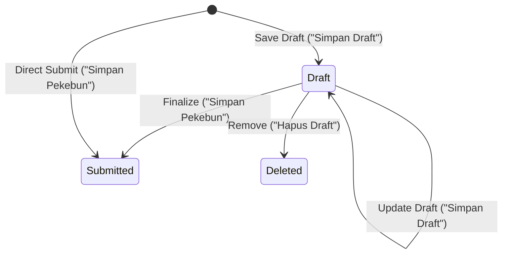

# Data Model: Resuming Saved Draft Pekebun Data (032-resume-draft-pekebun)

## Entity Specifications

### 1. `Pekebun` Entity (Updated)
Extends the existing `Pekebun` data structure in `src/types/pekebun.ts` with draft state management.

```typescript
export interface Pekebun {
  id: string; // e.g. 'PKB-001'
  nik: string;
  nama: string;
  nomorKK: string;
  statusPernikahan: StatusPernikahan;
  tempatLahir: string;
  tanggalLahir: string;
  alamat: string;
  kodepos: string;
  nomorHP: string;
  dokumen: DokumenPekebun[];
  lahan: LahanPekebun;
  daftarLahan: LahanPekebun[];
  isDraft?: boolean; // Flag indicating whether entry is a saved draft
  createdAt: string; // ISO date timestamp
  updatedAt?: string; // ISO date timestamp when draft was last saved
}
```

### 2. `IdentitasFormData` Entity
Form state for Step 1 (Identitas Pekebun):

```typescript
export interface IdentitasFormData {
  nik: string;
  nama: string;
  nomorKK: string;
  statusPernikahan: string;
  tempatLahir: string;
  tanggalLahir: string;
  alamat: string;
  kodepos: string;
  nomorHP: string;
}
```

### 3. `DokumenFormData` Entity
Form state for Step 2 (Dokumen Pekebun):

```typescript
export interface DokumenFormData {
  scanKTP: File | null;
  scanKK: File | null;
  swafoto: File | null;
  suratKuasa: File | null;
  existingKtpUrl?: string;
  existingKkUrl?: string;
  existingSwafotoUrl?: string;
  existingSuratKuasaUrl?: string;
}
```

### 4. `LahanFormData` Entity
Form state for Step 3 (Data Lahan Pekebun):

```typescript
export interface LahanFormData {
  jenisLegalitas: string;
  nomorLegalitas: string;
  tanggalPenerbitanLegalitas: string;
  luasLahan: number | string;
  provinsiKode: string;
  kabupatenKode: string;
  kecamatanKode: string;
  desaKode: string;
  alamatKebun: string;
  tahunTanam: number | string;
  jenisBibit: string;
  scanLegalitas: File | null;
  existingScanLegalitasUrl?: string;
  nomorSuratBedaNama?: string;
  koordinatPoligon: string;
}
```

## State Transitions & Validation Rules



### Validation Rules Matrix

| Field / Section | Save Draft Mode | Final Submission Mode |
|---|---|---|
| **NIK** | 16 digits mandatory | 16 digits + Dukcapil Lookup Verified |
| **Identitas (Nama, KK, Alamat)** | Optional | Mandatory |
| **Dokumen Uploads** | Optional | All 4 mandatory files attached |
| **Data Lahan** | Optional | Minimum 1 valid land record + land document |
