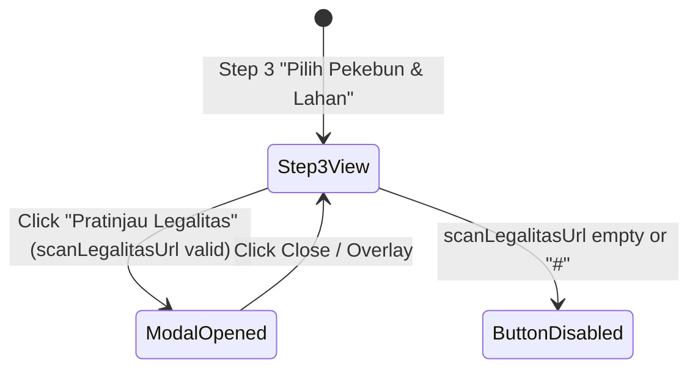

# Data Model: Land Legal Document Preview in Proposal Submission (033-preview-legalitas-lahan)

## Entity Specifications

### 1. `LahanPekebun` (Existing Entity)
The existing `LahanPekebun` entity in `src/types/pekebun.ts` holds land details:

```typescript
export interface LahanPekebun {
  id: string;
  pekebunId: string;
  jenisLegalitas: JenisLegalitas;
  nomorLegalitas: string;
  tanggalPenerbitanLegalitas: string;
  luasLahan: number;
  provinsiKode: string;
  provinsiNama: string;
  kabupatenKode: string;
  kabupatenNama: string;
  kecamatanKode: string;
  kecamatanNama: string;
  desaKode: string;
  desaNama: string;
  alamatKebun: string;
  tahunTanam: number;
  jenisBibit: string;
  scanLegalitasUrl: string; // Document URL / Data URL for land legal certificate
  nomorSuratBedaNama?: string;
  koordinatPoligon: string;
}
```

### 2. Document Preview Staging State (`StepPilihPekebunLahan.vue`)

```typescript
interface PreviewDocState {
  dataUrl: string;
  mimeType: string;
  title: string;
}

const showDocPreview = ref<boolean>(false);
const previewDoc = ref<PreviewDocState | null>(null);
```

## UI State Diagram


