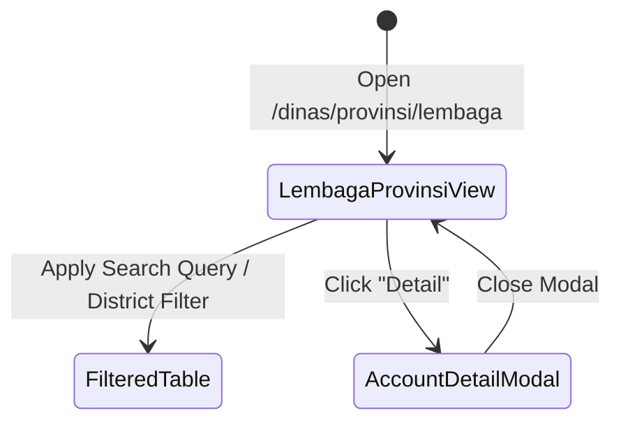

# Data Model: Provincial Dinas Institutional Accounts (034-sidebar-lembaga-provinsi)

## Entity Specifications

### `LembagaAccount` Interface

```typescript
export interface LembagaAccount {
  id: string;
  namaLembaga: string;
  jenisLembaga: 'Kelompok Tani' | 'Gapoktan' | 'Koperasi Pekebun' | 'Kelembagaan Pekebun Lainnya';
  nomorLegalitas: string; // NIB / SK Kemenkumham / SK Pembentukan
  ketuaNama: string;
  ketuaNik: string;
  email: string;
  telepon: string;
  provinsiKode: string;
  provinsiNama: string;
  kabupatenKode: string;
  kabupatenNama: string;
  kecamatanNama: string;
  desaNama: string;
  alamatLengkap: string;
  jumlahAnggota: number;
  totalLuasLahanHa: number;
  statusAkun: 'Aktif' | 'Terverifikasi' | 'Menunggu Verifikasi';
  registeredAt: string;
}
```

## Component State Diagram


