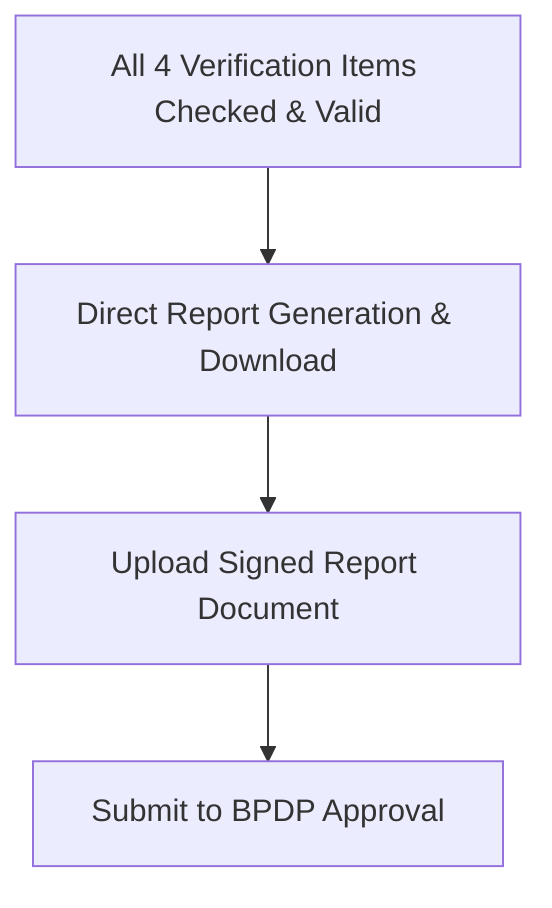

# Data Model: BPDP Verifikator UI Simplification (037-remove-layak-options-bpdp)

## UI Template State Transformation

*Note*: Radio inputs for `Layak / Tidak Layak` are removed from the DOM template.
