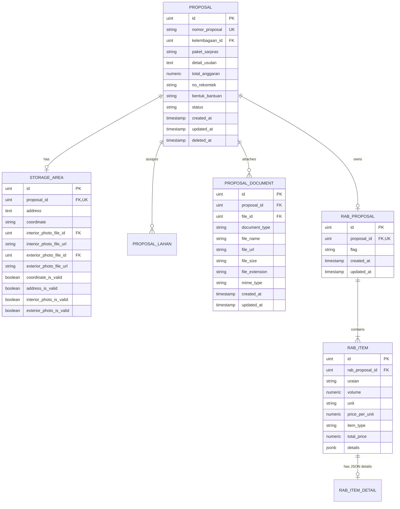
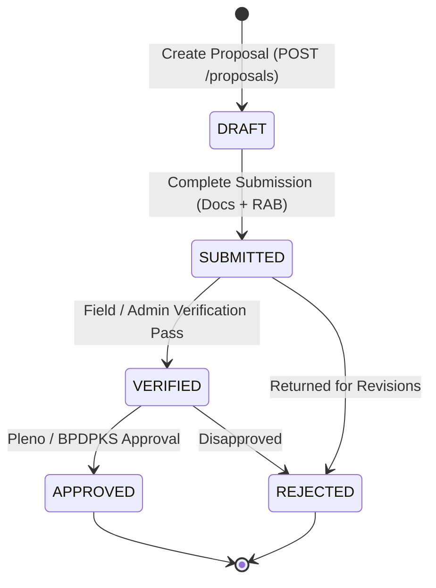

# Data Model: Proposal, Documents & RAB Entities

**Feature**: `039-proposal-rab-api-alignment`  
**Date**: 2026-08-24  
**Spec Reference**: [spec.md](./spec.md)

---

## 1. Entity Relationship Diagram



---

## 2. TypeScript Interfaces

### 2.1 Proposal Interfaces (`src/types/pengusulan.ts`)

```typescript
export enum ProposalStatus {
  DRAFT = 'DRAFT',
  SUBMITTED = 'SUBMITTED',
  VERIFIED = 'VERIFIED',
  APPROVED = 'APPROVED',
  REJECTED = 'REJECTED',
}

export type DocumentType =
  | 'SURAT_PERMOHONAN'
  | 'DOKUMEN_LEGALITAS_KELEMBAGAAN'
  | 'SURAT_PERNYATAAN_KEABSAHAN'
  | 'PROPOSAL_TEKNIS'
  | 'SPTJM'
  | 'DOKUMEN_PENDUKUNG'
  | string;

export interface StorageArea {
  id?: number;
  proposal_id?: number;
  address: string;
  coordinate: string;
  interior_photo_file_id?: number | null;
  interior_photo_file_url?: string | null;
  exterior_photo_file_id?: number | null;
  exterior_photo_file_url?: string | null;
  coordinate_is_valid?: boolean | null;
  address_is_valid?: boolean | null;
  interior_photo_is_valid?: boolean | null;
  exterior_photo_is_valid?: boolean | null;
}

export interface ProposalDocument {
  id: number;
  proposal_id: number;
  file_id: number;
  document_type: DocumentType;
  file_name: string;
  file_url: string;
  file_size: string | number;
  file_extension: string;
  mime_type: string;
  created_at: string;
  updated_at?: string;
}

export interface Proposal {
  id: number;
  nomor_proposal: string;
  kelembagaan_id: number;
  paket_sarpras: string;
  detail_usulan: string;
  total_anggaran: number;
  no_rekomtek?: string | null;
  bentuk_bantuan?: string | null;
  status: ProposalStatus | string;
  created_at: string;
  updated_at: string;
  storage_area?: StorageArea | null;
  documents?: ProposalDocument[];
  rabs?: RabProposal[];
  pekebuns?: any[];
}

export interface CreateProposalPayload {
  kelembagaan_id: number;
  paket_sarpras: string;
  nomor_proposal?: string;
  detail_usulan?: string;
  no_rekomtek?: string;
  bentuk_bantuan?: string;
  lahan_ids: number[];
  storage_area?: {
    address?: string;
    coordinate?: string;
    interior_photo_file_id?: number | null;
    exterior_photo_file_id?: number | null;
  } | null;
}

export interface UpdateProposalPayload {
  paket_sarpras?: string;
  detail_usulan?: string;
  no_rekomtek?: string;
  bentuk_bantuan?: string;
  status?: string;
  lahan_ids?: number[];
  storage_area?: StorageArea | null;
}
```

### 2.2 Budget Plan (RAB) Interfaces (`src/types/rab.ts`)

```typescript
export enum RabFlag {
  PROPOSAL = 'PROPOSAL',
  VERIFIKASI = 'VERIFIKASI',
  REKOMTEK = 'REKOMTEK',
  FINAL = 'FINAL',
}

export enum RabItemType {
  BARANG = 'BARANG',
  JASA = 'JASA',
  LAINNYA = 'LAINNYA',
}

export interface RabItemStageDetails {
  jenis?: string;
  jumlahTahap1?: number | null;
  jumlahTahap2?: number | null;
  spesifikasi?: string;
  [key: string]: any;
}

export interface RabItem {
  id: number | string;
  rab_proposal_id?: number | null;
  uraian: string;
  volume: number;
  unit: string;
  price_per_unit: number;
  item_type: RabItemType | string;
  total_price: number;
  details?: RabItemStageDetails | null;
}

export interface RabProposal {
  id: number;
  proposal_id: number;
  flag: RabFlag | string;
  items: RabItem[];
  created_at: string;
  updated_at: string;
}

export interface CreateRabItemPayload {
  uraian: string;
  volume: number;
  unit: string;
  price_per_unit: number;
  item_type: string;
  details?: Record<string, any> | null;
}

export interface CreateRabPayload {
  proposal_id: number;
  flag?: string;
  items: CreateRabItemPayload[];
}

export interface UpdateRabPayload {
  flag?: string;
  items: CreateRabItemPayload[];
}
```

---

## 3. State Transition Matrix


