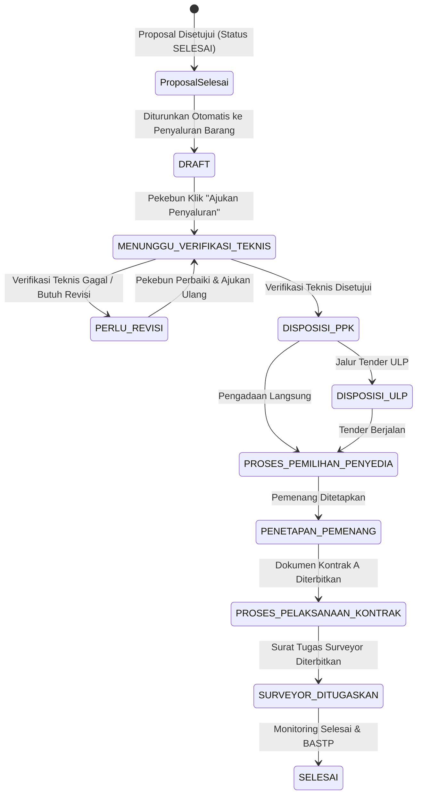

# Data Model: Integrasi Penyaluran Barang dari Proposal Selesai

**Feature**: `050-penyaluran-from-proposal`
**Date**: 2026-08-28

## Entities & Type Definitions

### 1. `PermohonanPenyaluranBarang`

Mewakili entitas permohonan penyaluran barang yang diturunkan dari proposal yang telah selesai.

```typescript
export type PaketKategori = 'Ekstensifikasi' | 'Intensifikasi';

export type StatusPermohonanBarang =
  | 'DRAFT'                       // Siap Diajukan Salur oleh Pekebun
  | 'MENUNGGU_VERIFIKASI_TEKNIS'  // Telah diajukan oleh Pekebun, masuk tim teknis BPDP
  | 'PERLU_REVISI'                // Catatan perbaikan dari tim teknis
  | 'DISPOSISI_PPK'               // Verifikasi teknis disetujui, masuk ke PPK
  | 'DISPOSISI_ULP'               // Disposisi tender ke Pokja ULP
  | 'PROSES_PEMILIHAN_PENYEDIA'   // Pelaksanaan tender penyedia
  | 'PENETAPAN_PEMENANG'          // Pemenang tender telah ditetapkan
  | 'PROSES_PELAKSANAAN_KONTRAK'  // Penerbitan Dokumen Kontrak A
  | 'SURVEYOR_DITUGASKAN'         // Penugasan surveyor sampling & monitoring
  | 'SELESAI';                    // Penyaluran dan BASTP selesai

export interface ItemPreferensiRAB {
  id: string;
  jenisBarang: string;            // 'Benih', 'Pupuk', 'Pestisida', 'Peralatan'
  namaBarangVarietas: string;     // Spesifikasi / nama komoditas
  jumlahTahap1?: number | null;
  jumlahTahap2?: number | null;
  jumlah: number;                 // Total kuantitas
  satuan: string;                 // 'Btg', 'Kg', 'Liter', 'Unit', 'Paket'
  estimasiHargaSatuan: number;    // Harga per unit (Rp)
  estimasiTotal: number;          // Total harga (Rp)
}

export interface PermohonanPenyaluranBarang {
  id: string;                     // ID unik penyaluran (e.g. 'PB-2026-001')
  proposalId?: string;            // ID proposal referensi yang telah SELESAI
  nomorPermohonan: string;        // Nomor registrasi penyaluran / proposal
  namaLembagaPekebun: string;     // Nama Koperasi / Gapoktan / Poktan
  namaKetua: string;              // Nama Ketua Lembaga
  kontak: string;                 // Nomor telepon / WA
  desa: string;
  kecamatan: string;
  kabupaten: string;
  provinsi: string;
  kategoriPaket: PaketKategori;   // 'Ekstensifikasi' | 'Intensifikasi'
  itemsRAB: ItemPreferensiRAB[];  // Rincian alokasi barang dari proposal
  tanggalPengajuan?: string;      // Tanggal pekebun mengklik "Ajukan Penyaluran"
  
  // Status & Workflow
  status: StatusPermohonanBarang;
  catatanVerifikasiTeknis?: string;
  catatanPpk?: string;
  catatanUlp?: string;

  // Tender & Kontrak
  jalurPengadaan?: 'ULP_TENDER' | 'PENGADAAN_LANGSUNG';
  pemenangVendor?: string;
  nilaiPemenangTender?: number;
  tanggalPenetapanPemenang?: string;
  dokumenKontrak?: DokumenKontrakA;
  suratTugasSurveyor?: SuratTugasSurveyor;

  createdAt: string;
  updatedAt: string;
}
```

## State Transitions


