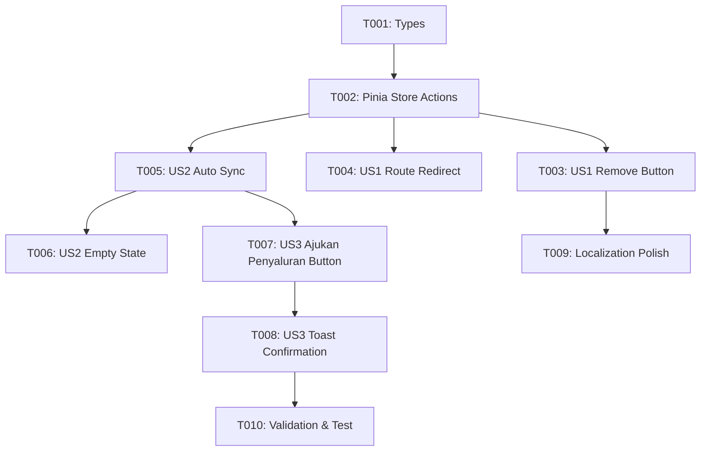

# Tasks: Integrasi Penyaluran Barang dari Proposal Selesai

**Input**: Design documents from `/specs/050-penyaluran-from-proposal/`

**Prerequisites**: plan.md (required), spec.md (required for user stories), research.md, data-model.md, contracts/

**Organization**: Tasks are grouped by user story to enable independent implementation and testing of each story.

## Format: `[ID] [P?] [Story] Description`

- **[P]**: Can run in parallel (different files, no dependencies)
- **[Story]**: Which user story this task belongs to (e.g., US1, US2, US3)
- Include exact file paths in descriptions

---

## Phase 1: Setup & Types

**Purpose**: Type definitions and base structures

- [X] T001 [P] Update `StatusPermohonanBarang` and `PermohonanPenyaluranBarang` types in `src/types/penyaluranBarang.ts` to include `proposalId` and `DRAFT` status

---

## Phase 2: Foundational (Pinia Store & State Management)

**Purpose**: Store actions and synchronization logic required by all user stories

- [X] T002 Implement `syncCompletedProposals` and `ajukanPenyaluran` actions in `src/stores/penyaluranBarang.ts` to handle completed proposal conversion and status transition to `MENUNGGU_VERIFIKASI_TEKNIS`

---

## Phase 3: User Story 1 - Penghapusan Tombol 'Buat Permohonan Baru' & Form Manual (Priority: P1)

**Goal**: Halaman penyaluran barang tidak lagi menampilkan tombol tambah manual dan memblokir rute form manual

**Independent Test**: Buka `/penyaluran-barang/pemohon`, pastikan tombol "Buat Permohonan Baru" tidak ada. Akses `/penyaluran-barang/pemohon/tambah` dan pastikan dialihkan kembali ke daftar utama.

- [X] T003 [US1] Remove "Buat Permohonan Baru" button from header and table empty state in `src/views/penyaluran-barang/PekebunPermohonanBarangView.vue`
- [X] T004 [US1] Add route redirect from `/penyaluran-barang/pemohon/tambah` to `/penyaluran-barang/pemohon` in `src/router/index.ts`

---

## Phase 4: User Story 2 - Menampilkan Daftar Penyaluran Otomatis dari Proposal Selesai (Priority: P1)

**Goal**: Data penyaluran barang secara otomatis diturunkan dari proposal berstatus `SELESAI`

**Independent Test**: Pastikan proposal dengan status `SELESAI` otomatis muncul pada tabel daftar penyaluran dengan status awal `Draft` (Siap Diajukan Salur).

- [X] T005 [US2] Integrate proposal synchronization in `src/views/penyaluran-barang/PekebunPermohonanBarangView.vue` on mounted/setup to load completed proposals into the penyaluran queue
- [X] T006 [US2] Update empty state design and informative text in `src/views/penyaluran-barang/PekebunPermohonanBarangView.vue` to guide users that penyaluran is generated from completed proposals

---

## Phase 5: User Story 3 - Inisiasi Aksi 'Ajukan Penyaluran' & Detail Modal (Priority: P2)

**Goal**: Pekebun dapat mengajukan permohonan penyaluran dari item berstatus `DRAFT` dan memantau detailnya

**Independent Test**: Klik tombol "Ajukan Penyaluran" pada baris `DRAFT`, pastikan status beralih menjadi `MENUNGGU_VERIFIKASI_TEKNIS` dan notifikasi berhasil muncul.

- [X] T007 [US3] Add interactive "Ajukan Penyaluran" button on table rows where `item.status === 'DRAFT'` in `src/views/penyaluran-barang/PekebunPermohonanBarangView.vue`
- [X] T008 [US3] Wire toast feedback and status confirmation in `src/views/penyaluran-barang/PekebunPermohonanBarangView.vue` when penyaluran is successfully submitted

---

## Phase 6: Polish & Verification

**Purpose**: Localization, typechecking, and regression testing

- [X] T009 [P] Update and externalize labels and messages in `src/config/localization.ts`
- [X] T010 Run `npx vue-tsc --noEmit` and `npm run test` to verify zero type errors or test regressions

---

## Dependencies & Execution Order

## Implementation Strategy

1. **MVP (Phase 1-4)**: Selesaikan User Story 1 & 2 terlebih dahulu (penghapusan tombol & integrasi data proposal selesai).
2. **Interactive Promotion (Phase 5)**: Implementasikan tombol "Ajukan Penyaluran" untuk status draft.
3. **Verification (Phase 6)**: Validasi build TypeScript dan pengujian akhir.
