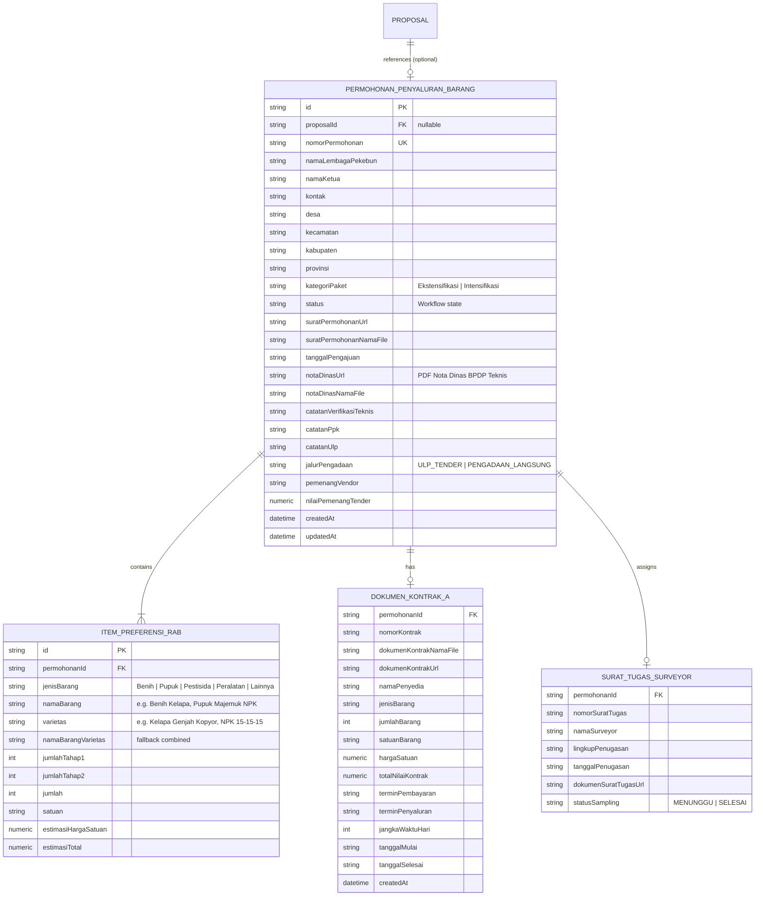
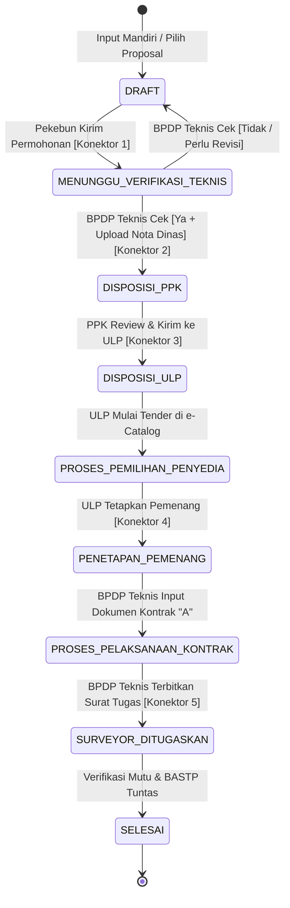

# Data Model: Penyelarasan Alur Modul Penyaluran Barang

## Entities & Relationships

```mermaid
erDiagram
    PROPOSAL ||--o| PERMOHONAN_PENYALURAN_BARANG : "references (optional)"
    PERMOHONAN_PENYALURAN_BARANG ||--|{ ITEM_PREFERENSI_RAB : "contains"
    PERMOHONAN_PENYALURAN_BARANG ||--o| DOKUMEN_KONTRAK_A : "has"
    PERMOHONAN_PENYALURAN_BARANG ||--o| SURAT_TUGAS_SURVEYOR : "assigns"

    PERMOHONAN_PENYALURAN_BARANG {
        string id PK
        string proposalId FK "nullable"
        string nomorPermohonan UK
        string namaLembagaPekebun
        string namaKetua
        string kontak
        string desa
        string kecamatan
        string kabupaten
        string provinsi
        string kategoriPaket "Ekstensifikasi | Intensifikasi"
        string status "Workflow state"
        string suratPermohonanUrl
        string suratPermohonanNamaFile
        string tanggalPengajuan
        string notaDinasUrl "PDF Nota Dinas BPDP Teknis"
        string notaDinasNamaFile
        string catatanVerifikasiTeknis
        string catatanPpk
        string catatanUlp
        string jalurPengadaan "ULP_TENDER | PENGADAAN_LANGSUNG"
        string pemenangVendor
        numeric nilaiPemenangTender
        datetime createdAt
        datetime updatedAt
    }

    ITEM_PREFERENSI_RAB {
        string id PK
        string permohonanId FK
        string jenisBarang "Benih | Pupuk | Pestisida | Peralatan | Lainnya"
        string namaBarang "e.g. Benih Kelapa, Pupuk Majemuk NPK"
        string varietas "e.g. Kelapa Genjah Kopyor, NPK 15-15-15"
        string namaBarangVarietas "fallback combined"
        int jumlahTahap1
        int jumlahTahap2
        int jumlah
        string satuan
        numeric estimasiHargaSatuan
        numeric estimasiTotal
    }

    DOKUMEN_KONTRAK_A {
        string permohonanId FK
        string nomorKontrak
        string dokumenKontrakNamaFile
        string dokumenKontrakUrl
        string namaPenyedia
        string jenisBarang
        int jumlahBarang
        string satuanBarang
        numeric hargaSatuan
        numeric totalNilaiKontrak
        string terminPembayaran
        string terminPenyaluran
        int jangkaWaktuHari
        string tanggalMulai
        string tanggalSelesai
        datetime createdAt
    }

    SURAT_TUGAS_SURVEYOR {
        string permohonanId FK
        string nomorSuratTugas
        string namaSurveyor
        string lingkupPenugasan
        string tanggalPenugasan
        string dokumenSuratTugasUrl
        string statusSampling "MENUNGGU | SELESAI"
    }
```

## State Transitions (Workflow State Machine)

```mermaid
stateDiagram-v2
    [*] --> DRAFT : Input Mandiri / Pilih Proposal
    DRAFT --> MENUNGGU_VERIFIKASI_TEKNIS : Pekebun Kirim Permohonan [Konektor 1]
    
    MENUNGGU_VERIFIKASI_TEKNIS --> DRAFT : BPDP Teknis Cek [Tidak / Perlu Revisi]
    MENUNGGU_VERIFIKASI_TEKNIS --> DISPOSISI_PPK : BPDP Teknis Cek [Ya + Upload Nota Dinas] [Konektor 2]
    
    DISPOSISI_PPK --> DISPOSISI_ULP : PPK Review & Kirim ke ULP [Konektor 3]
    
    DISPOSISI_ULP --> PROSES_PEMILIHAN_PENYEDIA : ULP Mulai Tender di e-Catalog
    PROSES_PEMILIHAN_PENYEDIA --> PENETAPAN_PEMENANG : ULP Tetapkan Pemenang [Konektor 4]
    
    PENETAPAN_PEMENANG --> PROSES_PELAKSANAAN_KONTRAK : BPDP Teknis Input Dokumen Kontrak "A"
    PROSES_PELAKSANAAN_KONTRAK --> SURVEYOR_DITUGASKAN : BPDP Teknis Terbitkan Surat Tugas [Konektor 5]
    SURVEYOR_DITUGASKAN --> SELESAI : Verifikasi Mutu & BASTP Tuntas
    SELESAI --> [*]
```
