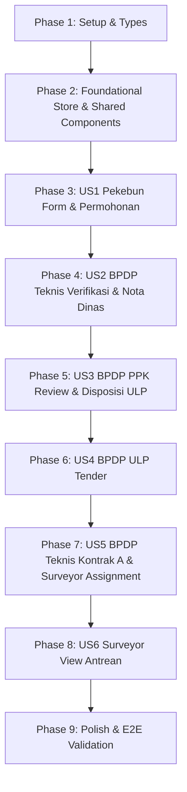

# Tasks: Penyelarasan Alur Modul Penyaluran Barang (SOP Swimlane)

**Input**: Design documents from `specs/056-penyaluran-barang-swimlane-alignment/`  
**Prerequisites**: `plan.md`, `spec.md`, `research.md`, `data-model.md`, `contracts/penyaluran-barang-api.md`, `quickstart.md`

## Format: `[ID] [P?] [Story] Description`

- **[P]**: Can run in parallel (different files, no dependencies)
- **[Story]**: Which user story this task belongs to (e.g., US1, US2, US3, US4, US5, US6)

---

## Phase 1: Setup (Shared Infrastructure & Types)

**Purpose**: Struktur data dan tipe TypeScript bersama untuk modul penyaluran barang

- [x] T001 [P] Validasi dan pastikan kelengkapan tipe TypeScript `PermohonanPenyaluranBarang`, `DokumenKontrakA`, `SuratTugasSurveyor`, `ItemPreferensiRAB`, serta field `notaDinasUrl` dan `notaDinasNamaFile` di `src/types/penyaluranBarang.ts`
- [x] T002 [P] Sinkronisasi konfigurasi rute navigasi untuk 5 peran pengguna di `src/router/index.ts`

---

## Phase 2: Foundational (State Management & Shared Components)

**Purpose**: Pinia Store dan komponen visual inti yang menjadi fondasi seluruh user story

- [x] T003 Implementasikan reactive workflow state machine dan action methods (`createPermohonan`, `verifikasiTeknis`, `disposisiPpk`, `mulaiTenderUlp`, `selesaikanTenderUlp`, `simpanDokumenKontrakA`, `terbitkanSuratTugasSurveyor`) di `src/stores/penyaluranBarang.ts`
- [x] T004 [P] Verifikasi komponen pelacak tahapan alur di `src/components/penyaluran-barang/PenyaluranTimelineTracker.vue`
- [x] T005 [P] Verifikasi generator PDF instan surat permohonan resmi dengan kolom terpisah Nama Barang dan Varietas di `src/utils/permohonanPdfGenerator.ts`

---

## Phase 3: User Story 1 - Pengajuan Permohonan oleh Kelembagaan Pekebun (Priority: P1) 🎯 MVP

**Goal**: Pengurus Kelembagaan Pekebun dapat memilih proposal sarpras yang telah disetujui, membuka modal pengajuan terpadu, me-review tabel preferensi RAB (read-only dengan kolom terpisah Nama Barang & Varietas), mengunduh format dokumen surat permohonan pengadaan barang (PDF), mengunggah surat bertandatangan basah, dan mengirim permohonan ke BPDP Teknis di dalam modal yang sama (Konektor 1).

**Independent Test**: Buka `/penyaluran-barang/pemohon`, klik *Ajukan Penyaluran* pada proposal, periksa review tabel RAB, klik *Download Format Surat Permohonan (PDF)*, upload berkas PDF bertandatangan, dan klik *Kirim Permohonan ke BPDP*. Status permohonan berubah menjadi `MENUNGGU_VERIFIKASI_TEKNIS`.

- [x] T006 [P] [US1] Sempurnakan tabel preferensi RAB (kolom terpisah Jenis Barang, Nama Barang, Varietas, Tahap 1, Tahap 2, Total Kuantitas, Satuan, Harga Satuan, dan Total Harga) di `src/components/penyaluran-barang/ItemRabFormTable.vue`
- [x] T007 [US1] Sempurnakan alur modal terpadu pengajuan permohonan (Review RAB, Download format surat PDF, Upload surat bertandatangan, dan Kirim) di `src/views/penyaluran-barang/PekebunPermohonanBarangView.vue`
- [x] T008 [US1] Sempurnakan antrean daftar proposal pekebun, badge status (`Draft`, `Verifikasi Teknis`), dan tombol aksi (*Ajukan Penyaluran* vs *Detail & Tracking*) di `src/views/penyaluran-barang/PekebunPermohonanBarangView.vue`

---

## Phase 4: User Story 2 - Verifikasi Teknis, Cek Iya/Tidak, Upload Nota Dinas & Kirim ke PPK oleh BPDP Teknis (Priority: P1)

**Goal**: BPDP Teknis dapat memeriksa berkas permohonan dari Konektor 1. Jika **Tidak**, permohonan dikembalikan ke status `DRAFT` (dengan catatan perbaikan). Jika **Ya**, form mewajibkan upload berkas PDF **Nota Dinas Direktur Teknis** (maks 5 MB) dan menekan tombol *"Kirim ke BPDP PPK"* (`DISPOSISI_PPK` - Konektor 2).

**Independent Test**: Buka `/penyaluran-barang/verifikator`, pilih permohonan baru `MENUNGGU_VERIFIKASI_TEKNIS`, uji skenario penolakan (status kembali ke `DRAFT`), dan uji skenario persetujuan (unggah berkas PDF Nota Dinas, klik Kirim ke PPK, status berubah menjadi `DISPOSISI_PPK`).

- [x] T009 [P] [US2] Sesuaikan modal dialog `VerifikasiTeknisModal.vue` dengan opsi Cek (Iya/Tidak), dropzone upload PDF Nota Dinas jika "Ya", input catatan revisi jika "Tidak", dan tombol aksi *"Kirim ke BPDP PPK"* vs *"Kembalikan ke Draft Pekebun"* di `src/components/penyaluran-barang/VerifikasiTeknisModal.vue`
- [x] T010 [US2] Hubungkan aksi verifikasi teknis dan penyimpanan berkas Nota Dinas ke antrean verifikasi di `src/views/penyaluran-barang/BpdpVerifikatorBarangView.vue`

---

## Phase 5: User Story 3 - Review Dokumen & Disposisi Universal oleh BPDP PPK (Priority: P1)

**Goal**: BPDP PPK menerima berkas Surat Permohonan & Nota Dinas dari Konektor 2, me-review seluruh dokumen, lalu menekan tombol aksi universal *"Kirim ke BPDP ULP"* / *"Lanjutkan ke BPDP ULP"* untuk meneruskan mandat pengadaan ke antrean ULP (`DISPOSISI_ULP` - Konektor 3).

**Independent Test**: Buka `/penyaluran-barang/ppk`, pilih permohonan berstatus `DISPOSISI_PPK`, telaah berkas Nota Dinas dan Surat Permohonan, lalu klik *Kirim ke BPDP ULP*. Status berubah menjadi `DISPOSISI_ULP`.

- [x] T011 [P] [US3] Sesuaikan panel review berkas (Surat Permohonan Pekebun & Nota Dinas BPDP Teknis) dan modal konfirmasi disposisi di `src/components/penyaluran-barang/DisposisiPpkModal.vue`
- [x] T012 [US3] Sederhanakan tombol aksi di antrean dan panel detail BPDP PPK menjadi tombol universal *"Lanjutkan ke BPDP ULP"* di `src/views/penyaluran-barang/BpdpPpkBarangView.vue`

---

## Phase 6: User Story 4 - Pemilihan Penyedia di e-Catalog & Tombol Selesai oleh BPDP ULP (Priority: P1)

**Goal**: BPDP ULP menerima tiket dari Konektor 3, mengubah status menjadi `PROSES_PEMILIHAN_PENYEDIA` saat tender dimulai di e-catalog (luar aplikasi), dan menekan tombol *"Selesai"* dengan dialog konfirmasi penyelesaian untuk mengalirkan tiket ke BPDP Teknis (`PENETAPAN_PEMENANG` - Konektor 4).

**Independent Test**: Buka `/penyaluran-barang/ulp`, pilih permohonan `DISPOSISI_ULP`, klik *Mulai Pemilihan Penyedia* (status berubah ke `PROSES_PEMILIHAN_PENYEDIA`), kemudian klik *Selesai* dan konfirmasi dialog. Status berubah menjadi `PENETAPAN_PEMENANG`.

- [x] T013 [P] [US4] Sempurnakan dialog konfirmasi penyelesaian pemilihan penyedia e-catalog di `src/components/penyaluran-barang/TenderUlpModal.vue` / dialog konfirmasi di `src/views/penyaluran-barang/BpdpUlpBarangView.vue`
- [x] T014 [US4] Sempurnakan tombol *"Mulai Pemilihan Penyedia"* dan tombol *"Selesai"* pada antrean dan panel detail BPDP ULP di `src/views/penyaluran-barang/BpdpUlpBarangView.vue`

---

## Phase 7: User Story 5 - Input Dokumen Kontrak & Penugasan Surveyor oleh BPDP Teknis (Priority: P1)

**Goal**: BPDP Teknis menerima tiket dari Konektor 4 (`PENETAPAN_PEMENANG`), menginput 10 atribut wajib Dokumen Kontrak langsung di dalam panel detail (di bawah tabel RAB tanpa modal bertumpuk), menekan tombol *"Proses Pelaksanaan Kontrak"* (`PROSES_PELAKSANAAN_KONTRAK`), dan menerbitkan surat tugas sampling & monitoring ke Surveyor (`SURVEYOR_DITUGASKAN` - Konektor 5).

**Independent Test**: Buka `/penyaluran-barang/verifikator`, pilih permohonan berstatus `PENETAPAN_PEMENANG`, lengkapi 10 atribut Dokumen Kontrak langsung di panel detail, klik *Proses Pelaksanaan Kontrak*, verifikasi status berubah ke `PROSES_PELAKSANAAN_KONTRAK`, lalu terbitkan surat tugas surveyor.

- [x] T015 [US5] Sematkan form 10 atribut Dokumen Kontrak dan dropzone upload PDF langsung di dalam panel detail permohonan `src/views/penyaluran-barang/BpdpVerifikatorBarangView.vue`
- [x] T016 [US5] Hubungkan tombol aksi *"Proses Pelaksanaan Kontrak"* untuk mengubah status tiket menjadi `PROSES_PELAKSANAAN_KONTRAK` di `src/views/penyaluran-barang/BpdpVerifikatorBarangView.vue`
- [x] T017 [P] [US5] Sempurnakan dialog penerbitan surat tugas monitoring surveyor di `src/components/penyaluran-barang/SuratTugasSurveyorModal.vue` / panel terkait

---

## Phase 8: User Story 6 - View-Only Antrean Penugasan Surveyor (Priority: P2)

**Goal**: Surveyor dapat melihat daftar penugasan monitoring sampling mutu fisik komoditas sarpras kelapa di titik gudang pekebun dan mengunduh berkas surat tugas.

**Independent Test**: Buka `/penyaluran-barang/surveyor`, verifikasi antrean paket yang ditugaskan muncul beserta nomor surat tugas dan rincian lokasi gudang pekebun.

- [x] T018 [US6] Sempurnakan tampilan antrean penugasan monitoring surveyor di `src/views/penyaluran-barang/SurveyorBarangView.vue`

---

## Phase 9: Polish & Cross-Cutting Validation

**Purpose**: Verifikasi menyeluruh alur end-to-end simulasi SOP Swimlane

- [x] T019 [P] Jalankan pengujian end-to-end simulasi lengkap sesuai skenario di `specs/056-penyaluran-barang-swimlane-alignment/quickstart.md`
- [x] T020 [P] Verifikasi konsistensi tema visual Tailwind CSS, status badge, dark mode, dan responsivitas antarmuka di seluruh 5 view peran pengguna

---

## Dependencies & Execution Order

### Parallel Opportunities

- **Phase 4**: `T009` dapat disiapkan secara mandiri sebelum integrasi `T010`.
- **Phase 5**: `T011` dapat disiapkan paralel sebelum integrasi `T012`.
- **Phase 9**: `T019` dan `T020` dapat dikerjakan secara paralel.
