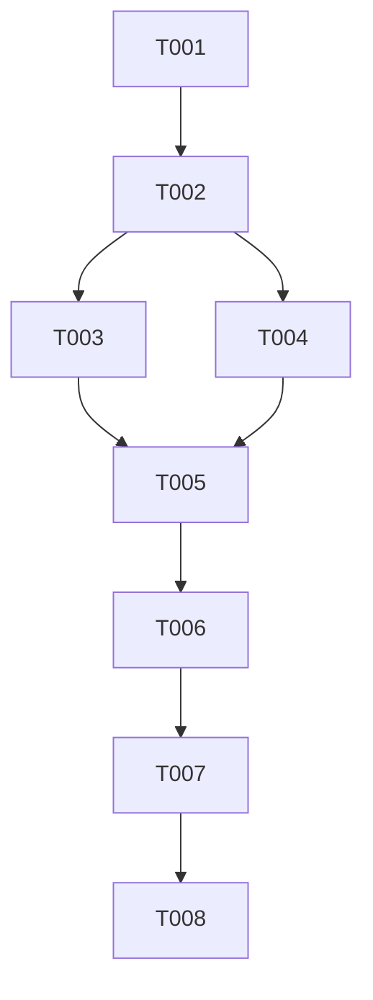

# Tasks: Fix RAB Display and Synchronization in Proposal Verification

**Feature**: `058-fix-rab-verifikasi-proposal`
**Spec**: [spec.md](./spec.md)
**Plan**: [plan.md](./plan.md)

## Phase 1: Setup

- [X] T001 Initialize feature context and verify `bpdp-sarpras-kelapa-fe` build status with `npm run build`

## Phase 2: Foundational

- [X] T002 Verify `RabItem` interface and property aliases in `bpdp-sarpras-kelapa-fe/src/types/rab.ts`

## Phase 3: User Story 1 - Automatic Load and Sync of RAB Items (Priority: P1)

### Story Goal
Ensure RAB items automatically load and populate when opening the proposal verification page (`StepVerifikasiPekebunDanDokumenProposal.vue`), handling all backend payload format variations and maintaining isolated draft state.

### Independent Test Criteria
Open `/dinas/verifikasi/kabupaten/<proposal-id>`, verify that the RAB Proposal section and RabTable populate immediately with all proposal items, and confirm switching proposals re-populates correctly.

### Implementation Tasks

- [X] T003 [P] [US1] Extend backend RAB payload normalization in `bpdp-sarpras-kelapa-fe/src/stores/pengusulan.ts` (`getProposalDetail`) to handle flat and nested RAB item payloads (`item.rabs`, `item.rab_items`, `item.rabItems`, `item.rab_proposals`, `item.rab`)
- [X] T004 [P] [US1] Add proposal ID scoping and reset helper in `bpdp-sarpras-kelapa-fe/src/stores/verifikasiKabDraft.ts` to isolate `rabItems` per proposal
- [X] T005 [US1] Update `watch` in `bpdp-sarpras-kelapa-fe/src/views/dinas/kabupaten/StepVerifikasiPekebunDanDokumenProposal.vue` to watch `pengajuan.value?.rabItems` with `{ immediate: true, deep: true }` and update `verifikasiStore.rabItems`
- [X] T006 [US1] Ensure fallback display and calculation safety in `bpdp-sarpras-kelapa-fe/src/components/pengusulan/RabTable.vue` for initialized RAB items

## Phase 4: Polish & Verification

- [X] T007 Run type-check (`npx vue-tsc -b`) and build validation (`npm run build`) in `bpdp-sarpras-kelapa-fe`
- [X] T008 [P] Update quickstart verification log in `bpdp-sarpras-kelapa-fe/specs/058-fix-rab-verifikasi-proposal/quickstart.md`

---

## Dependencies & Execution Order

## Parallel Execution Opportunities

- T003 and T004 can be implemented in parallel (store logic updates).
- T008 can run in parallel with post-implementation documentation updates.

## Suggested MVP Scope
Complete Phase 1 through Phase 4 (T001 to T008).
