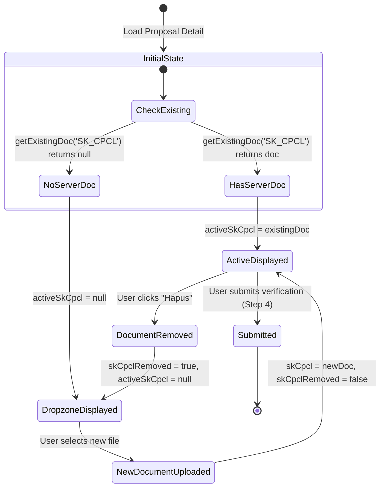

# Data Model & State Specification: Fix Reupload & Removal of SK CPCL Documents

## Overview

This specification details the client-side state model changes in Pinia (`useVerifikasiKabDraftStore`) and Vue components (`StepDataCPCL.vue`, `StepSummaryDanSubmit.vue`) to support explicit document removal and re-uploading for SK CPCL and related verification documents.

---

## Pinia Store Model: `VerifikasiKabDraftState`

### State Fields

| Field Name | Type | Initial Value | Description |
| :--- | :--- | :--- | :--- |
| `skCpcl` | `DokumenUpload \| null` | `null` | Holds newly uploaded SK CPCL document draft object |
| `skCpclRemoved` | `boolean` | `false` | Explicit flag indicating user clicked "Hapus" for SK CPCL |
| `beritaAcaraDokumen` | `DokumenUpload \| null` | `null` | Holds newly uploaded Berita Acara Verifikasi Dokumen |
| `beritaAcaraDokumenRemoved` | `boolean` | `false` | Explicit flag indicating removal of Berita Acara Verifikasi Dokumen |
| `beritaAcaraLapangan` | `DokumenUpload \| null` | `null` | Holds newly uploaded Berita Acara Verifikasi Lapangan |
| `beritaAcaraLapanganRemoved` | `boolean` | `false` | Explicit flag indicating removal of Berita Acara Verifikasi Lapangan |

---

## Store Actions & Getters

### Actions

1. `setSkCpcl(doc: DokumenUpload)`:
   - Sets `skCpcl = doc`
   - Sets `skCpclRemoved = false`

2. `removeSkCpcl()`:
   - Sets `skCpcl = null`
   - Sets `skCpclRemoved = true`

3. `setBeritaAcaraDokumen(doc: DokumenUpload)`:
   - Sets `beritaAcaraDokumen = doc`
   - Sets `beritaAcaraDokumenRemoved = false`

4. `removeBeritaAcaraDokumen()`:
   - Sets `beritaAcaraDokumen = null`
   - Sets `beritaAcaraDokumenRemoved = true`

5. `setBeritaAcaraLapangan(doc: DokumenUpload)`:
   - Sets `beritaAcaraLapangan = doc`
   - Sets `beritaAcaraLapanganRemoved = false`

6. `removeBeritaAcaraLapangan()`:
   - Sets `beritaAcaraLapangan = null`
   - Sets `beritaAcaraLapanganRemoved = true`

7. `resetDraftState()`:
   - Resets all document states and removal flags to initial values upon proposal switch or completion.

---

## Component Computed Document Resolution Logic

In `StepDataCPCL.vue` and `StepSummaryDanSubmit.vue`:

```typescript
const activeSkCpcl = computed(() => {
  if (verifikasiStore.skCpclRemoved) return null;
  return verifikasiStore.skCpcl || getExistingDoc('SK_CPCL');
});
```

---

## Document State Lifecycle & Transition Diagram


