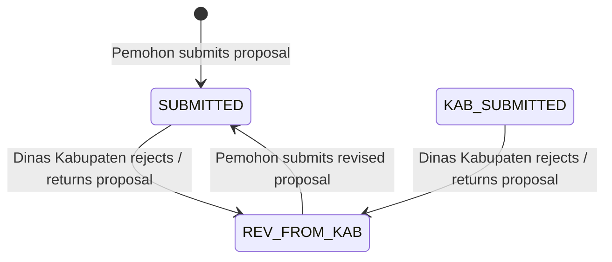

# Phase 1 Data Model & Status State Transitions

## Entity Status Enum Mapping

```typescript
export enum PengajuanStatus {
  DRAFT = 'DRAFT',
  SUBMITTED = 'SUBMITTED',
  KAB_SUBMITTED = 'KAB_SUBMITTED',
  REV_FROM_KAB = 'REV_FROM_KAB', // Standard status for proposal returned/rejected by Kabupaten
  PROV_SUBMITTED = 'PROV_SUBMITTED',
  REV_FROM_PROV = 'REV_FROM_PROV',
  REKOMTEK_ISSUED = 'REKOMTEK_ISSUED',
  REJECTED = 'REJECTED',
}
```

## State Transition Flow



## Payload Data Contract

When rejecting a proposal in Kabupaten verification:
- `proposal_id`: `string | number`
- `status`: `'REV_FROM_KAB'`
- `catatan` / `notes`: string explaining verification rejection reasons.
