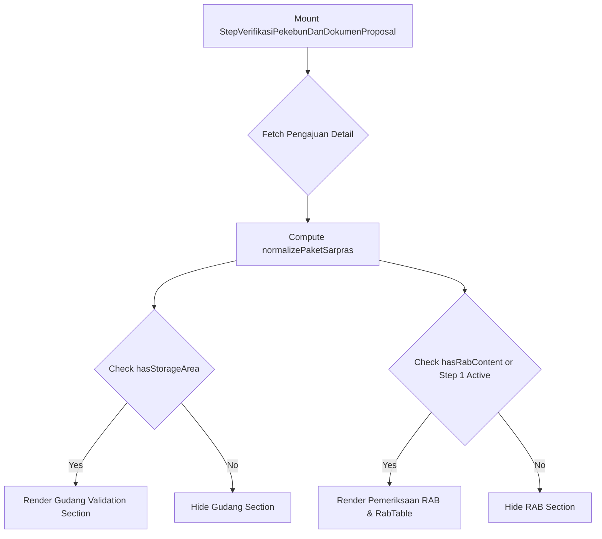

# Data Model & Visibility Specification: Fix RAB and Gudang Validation Display

## Overview

This specification details the component computed model and payload mapping adjustments required to reliably render Gudang (Storage Area) and RAB validation sections in `StepVerifikasiPekebunDanDokumenProposal.vue`.

---

## Component Computed Models

### 1. `hasStorageArea` Computed Guard

```typescript
const hasStorageArea = computed(() => {
  if (!pengajuan.value) return false;
  const sa = pengajuan.value.storage_area || pengajuan.value.gudangSerahTerima;
  const hasSaData = !!(sa && (sa.address || sa.alamat || sa.coordinate || sa.koordinat || sa.fotoTampakDepan || sa.fotoTampakDalam));
  return hasSaData || isPupukPaket.value;
});
```

---

### 2. `isPupukPaket` Normalized Package Guard

```typescript
const isPupukPaket = computed(() => {
  if (!pengajuan.value) return false;
  const raw = String(
    pengajuan.value.jenisSarpras ||
    pengajuan.value.jenis_sarpras ||
    pengajuan.value.paket_sarpras ||
    pengajuan.value.paketSarpras || ''
  ).toUpperCase().trim();

  return (
    raw.includes('EKSTENSIFIKASI') ||
    raw.includes('INTENSIFIKASI') ||
    raw.includes('PUPUK') ||
    raw.includes('FERTILIZER')
  );
});
```

---

### 3. `hasRabContent` Computed Guard

```typescript
const hasRabContent = computed(() => {
  if (!pengajuan.value) return false;
  const hasItems = (pengajuan.value.rabItems && pengajuan.value.rabItems.length > 0) || (verifikasiStore.rabItems && verifikasiStore.rabItems.length > 0);
  const hasDoc = !!getDokumen('RAB_RK');
  return hasItems || hasDoc;
});
```

---

## Component & Store Validation Keys Mapping

| Section | Validation Key | Target Property / Entity | Fallback Value |
| :--- | :--- | :--- | :--- |
| **Gudang Alamat** | `gudangAlamat` | `storage_area.address` / `gudangSerahTerima.alamat` | `'-'` |
| **Gudang Koordinat** | `gudangKoordinat` | `storage_area.coordinate` / `gudangSerahTerima.koordinat` | `'-'` |
| **Gudang Foto Depan** | `fotoTampakDepan` | `storage_area.fotoTampakDepan` | `null` |
| **Gudang Foto Dalam** | `fotoTampakDalam` | `storage_area.fotoTampakDalam` | `null` |
| **RAB Document** | `rabDocument` | Document `RAB_RK` / `RAB_PROPOSAL` | `null` |
| **RAB Items** | `rabItems` | `pengajuan.rabItems` array | `[]` |

---

## Visibility Flow Diagram


