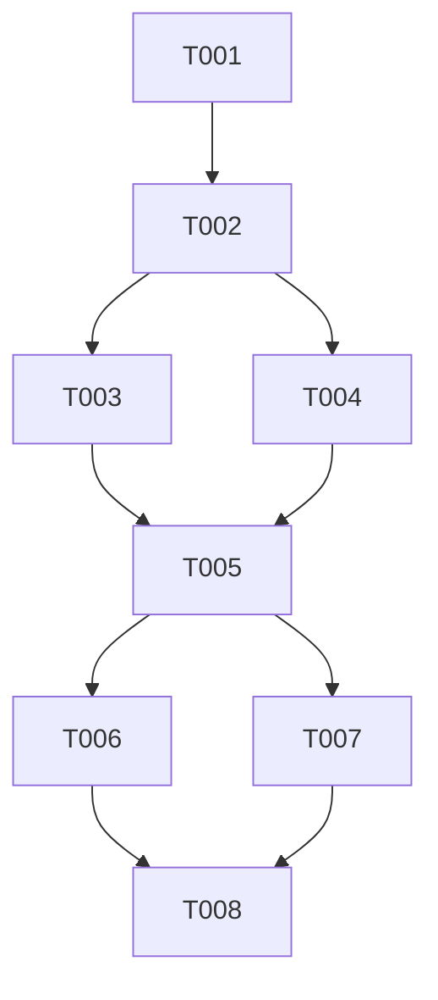

# Tasks: Sync Pekebun Document Validation Status

**Input**: Design documents from `bpdp-sarpras-kelapa-fe/specs/065-sync-pekebun-validation/`

**Prerequisites**: [plan.md](./plan.md), [spec.md](./spec.md), [research.md](./research.md), [data-model.md](./data-model.md), [contracts/ui-contract.md](./contracts/ui-contract.md)

**Organization**: Tasks are grouped by user story for incremental implementation and independent testing.

## Format: `[ID] [P?] [Story] Description`

- **[P]**: Can run in parallel (different files, no dependencies)
- **[Story]**: Which user story this task belongs to (e.g. US1, US2)

---

## Phase 1: Setup (Shared Infrastructure)

**Purpose**: Verification of project structure and dependencies

- [x] T001 Verify feature directory structure in `bpdp-sarpras-kelapa-fe/specs/065-sync-pekebun-validation/`

---

## Phase 2: Foundational (Blocking Prerequisites)

**Purpose**: Core store prerequisites that MUST be complete before user story work

- [x] T002 Inspect Pinia draft store state structure in `bpdp-sarpras-kelapa-fe/src/stores/verifikasiKabDraft.ts`

---

## Phase 3: User Story 1 - Accurately Display Existing Pekebun Validation Status (Priority: P1) 🎯 MVP

**Goal**: Ensure farmer document validation records (`validasi_dokumen_pekebun`) returned by backend API map accurately to CPCL items, populating Pinia draft store verification keys so status badges change from "Belum Diverifikasi" to "Sesuai" / "Valid".

**Independent Test**: Load `/dinas/verifikasi/kabupaten/22` with existing farmer validation data and verify farmer status badges render as "Sesuai".

### Implementation for User Story 1

- [x] T003 [P] [US1] Update `syncFarmerDocumentValidations` in `bpdp-sarpras-kelapa-fe/src/stores/verifikasiKabDraft.ts` to search CPCL objects across `daftarCPCL`, `documents`, `dokumen_pekebun`, and `pekebunStore.listPekebun` (by NIK lookup).
- [x] T004 [P] [US1] Enhance `syncFarmerDocumentValidations` in `bpdp-sarpras-kelapa-fe/src/stores/verifikasiKabDraft.ts` to populate parent key `doc-${cpclId}-${docId}` and field detail subKeys (`namaLengkap`, `nik`, `nomorKK`) when `is_valid === true`.
- [x] T005 [US1] Update `DetailVerifikasiKabView.vue` in `bpdp-sarpras-kelapa-fe/src/views/dinas/kabupaten/DetailVerifikasiKabView.vue` to pass `proposalRes.daftarCPCL || proposalRes.cpcl || proposalRes.pekebuns || []` to `syncFarmerDocumentValidations`.

**Checkpoint**: User Story 1 functional; existing farmer validation data renders correctly in UI.

---

## Phase 4: User Story 2 - Real-time Synchronization on Updates (Priority: P2)

**Goal**: Ensure UI state updates reactively when verifiers interact with detail views or submit updates.

**Independent Test**: Toggle field verification status in `VerifikasiPekebunDetailView.vue` and verify status badge updates reactively.

### Implementation for User Story 2

- [x] T006 [P] [US2] Verify reactive computation of `getPekebunStatus` in `bpdp-sarpras-kelapa-fe/src/views/dinas/kabupaten/StepVerifikasiPekebunDanDokumenProposal.vue`.
- [x] T007 [US2] Verify `VerifikasiPekebunDetailView.vue` in `bpdp-sarpras-kelapa-fe/src/views/dinas/kabupaten/VerifikasiPekebunDetailView.vue` initializes and synchronizes store state on page load.

---

## Phase 5: Polish & Cross-Cutting Concerns

- [x] T008 Execute manual verification steps per `bpdp-sarpras-kelapa-fe/specs/065-sync-pekebun-validation/quickstart.md`.

---

## Dependency Graph

## Implementation Strategy

1. **MVP Scope**: Complete Phase 1 through Phase 3 (T001-T005). This fixes the bug where valid data displays "Belum Diverifikasi".
2. **Incremental Delivery**: Move to Phase 4 (T006-T007) for real-time reactivity checks.
3. **Verification**: Run T008 manual verification against `http://localhost:5173/dinas/verifikasi/kabupaten/22`.
