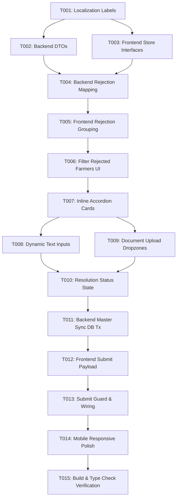

# Tasks: Revisi Data dan Dokumen Pekebun pada Proposal Usulan

**Input**: Design documents from `/specs/069-revisi-data-dokumen-pekebun/`
**Prerequisites**: plan.md (required), spec.md (required), research.md, data-model.md, contracts/

## Format: `[ID] [P?] [Story] Description`
- **[P]**: Can run in parallel (different files, no dependencies)
- **[Story]**: Which user story this task belongs to (e.g., US1, US2, US3)
- Include exact file paths in descriptions

---

## Phase 1: Setup (Shared Infrastructure)

**Purpose**: Menyiapkan label lokalisasi dan struktur dasar data revisi pekebun.

- [X] T001 Register localization labels for farmer revision headers, rejection alerts, and status badges in `bpdp-sarpras-kelapa-fe/src/config/localization.ts`

---

## Phase 2: Foundational (Blocking Prerequisites)

**Purpose**: Memperbarui DTO backend dan model state frontend yang menjadi prasyarat seluruh *user story*.

**⚠️ CRITICAL**: Harus selesai sebelum implementasi user story dimulai.

- [X] T002 [P] Extend backend DTOs in `bpdp-sarpras-kelapa-be/internal/proposal/dto.go` with `CategorizedRejectionItemResponse` farmer/land fields and `ResubmitProposalRevisionRequest` farmer/land update arrays per data-model.md
- [X] T003 [P] Define TypeScript interfaces for farmer rejection groups and form states in `bpdp-sarpras-kelapa-fe/src/stores/proposalRevisionStore.ts` per data-model.md

**Checkpoint**: Prasyarat DTO & Store siap - implementasi *user story* dapat dimulai.

---

## Phase 3: User Story 1 - Tinjauan Penolakan Khusus Data & Dokumen Pekebun (Priority: P1) 🎯 MVP

**Goal**: Pemohon hanya melihat daftar pekebun yang memiliki catatan penolakan pada Tab Pekebun & Lahan di halaman revisi usulan proposal. Pekebun yang sudah disetujui tidak ditampilkan.

**Independent Test**: Login sebagai Pemohon, buka proposal usulan berstatus `REV_FROM_KAB` yang memiliki 10 anggota CPCL dengan 2 pekebun ditolak. Pastikan Tab Pekebun & Lahan hanya menampilkan 2 kartu pekebun yang ditolak tersebut.

### Implementation for User Story 1
- [X] T004 [US1] Implement query and mapping of `validasi_dokumen_pekebuns` and `validasi_dokumen_lahans` into `categorized_rejections` with `category: "PEKEBUN"` in `bpdp-sarpras-kelapa-be/internal/proposal/service.go`
- [X] T005 [US1] Implement computed grouping of rejected farmers (`rejectedFarmerList`) by pekebun ID in `bpdp-sarpras-kelapa-fe/src/stores/proposalRevisionStore.ts`
- [X] T006 [US1] Update Tab `PEKEBUN` in `bpdp-sarpras-kelapa-fe/src/views/pemohon/RevisiProposalView.vue` to filter and render only rejected farmers, or display "Semua Data Pekebun Sesuai" if no rejections exist

**Checkpoint**: User Story 1 selesai dan dapat diverifikasi secara mandiri.

---

## Phase 4: User Story 2 - Koreksi Input Teks dan Unggah Berkas Pengganti yang Ditolak (Priority: P1)

**Goal**: Pemohon dapat mengoreksi input teks (Nama, NIK, No KK, Luas Lahan, dll) dan/atau mengunggah berkas scan baru hanya pada field dan dokumen yang secara spesifik ditolak oleh verifikator.

**Independent Test**: Pada kartu pekebun yang ditolak, periksa bahwa hanya field teks yang ditolak yang memiliki input edit dan hanya berkas yang ditolak yang memiliki dropzone upload baru. Setelah diisi dan diunggah, status kartu pekebun berubah menjadi "Telah Diperbarui".

### Implementation for User Story 2
- [X] T007 [US2] Implement inline expandable accordion cards for each rejected farmer in `bpdp-sarpras-kelapa-fe/src/views/pemohon/RevisiProposalView.vue`
- [X] T008 [US2] Implement contextual dynamic rendering of rejected text fields (Nama, NIK, No KK, Luas Lahan, Nomor Legalitas) with verifikator notes in `bpdp-sarpras-kelapa-fe/src/views/pemohon/RevisiProposalView.vue`
- [X] T009 [US2] Implement file upload dropzone and direct storage upload for rejected documents (Scan KTP, Scan KK, Swafoto, Surat Kuasa, Scan Legalitas, Surat Kades) in `bpdp-sarpras-kelapa-fe/src/views/pemohon/RevisiProposalView.vue`
- [X] T010 [US2] Implement reactive resolution state calculation and status badge updates ("Telah Diperbarui") in `bpdp-sarpras-kelapa-fe/src/stores/proposalRevisionStore.ts`

**Checkpoint**: User Story 1 dan User Story 2 berfungsi penuh secara terintegrasi.

---

## Phase 5: User Story 3 - Pengiriman Ulang Revisi & Pembaruan Otomatis Data Master Pekebun (Priority: P2)

**Goal**: Pemohon mengirim ulang usulan revisi, dan sistem secara otomatis memperbarui data teks dan berkas dokumen pada tabel master `pekebuns`, `dokumen_pekebuns`, `lahans`, dan `dokumen_lahans` di database.

**Independent Test**: Kirim ulang revisi yang berisi perubahan nama pekebun dan upload KK baru. Periksa tabel `pekebuns` dan `dokumen_pekebuns` di database untuk memastikan record master telah terupdate dan status proposal berubah kembali ke `SUBMITTED`.

### Implementation for User Story 3
- [X] T011 [US3] Implement DB transaction in `ResubmitProposalRevision` in `bpdp-sarpras-kelapa-be/internal/proposal/service.go` to update master tables `pekebuns`, `dokumen_pekebuns`, `lahans`, and `dokumen_lahans`
- [X] T012 [US3] Construct submission payload with `updated_farmers`, `updated_farmer_documents`, `updated_lands`, and `updated_land_documents` in `bpdp-sarpras-kelapa-fe/src/stores/proposalRevisionStore.ts`
- [X] T013 [US3] Wire submit action and validation guard in `bpdp-sarpras-kelapa-fe/src/views/pemohon/RevisiProposalView.vue` ensuring submission is blocked until all rejected items are resolved

**Checkpoint**: Seluruh alur end-to-end revisi pekebun dan sinkronisasi master data berfungsi sempurna.

---

## Phase 6: Polish & Cross-Cutting Concerns

**Purpose**: Verifikasi tampilan responsif, standar kode, dan build validation.

- [X] T014 [P] Verify responsive layout across mobile viewports (375px) and desktop with `#066C2A` brand styling in `bpdp-sarpras-kelapa-fe/src/views/pemohon/RevisiProposalView.vue`
- [X] T015 Run validation checks: `vue-tsc -b` and `npm run build` on frontend, and `go build ./cmd/api/main.go` on backend to ensure zero errors and full type safety

---

## Dependencies & Execution Order

---

## Implementation Strategy

### MVP First (User Story 1 & User Story 2)
1. Setup & Foundational: T001 - T003.
2. US1 (Tinjauan Penolakan): T004 - T006.
3. US2 (Koreksi Teks & Upload Berkas): T007 - T010.
4. Validasi MVP: Pemohon dapat melihat pekebun yang ditolak dan mengisi perbaikan secara reaktif.

### Full Delivery (User Story 3 & Polish)
5. US3 (Pengiriman Ulang & Sinkronisasi Master): T011 - T013.
6. Polish & Verifikasi: T014 - T015.
