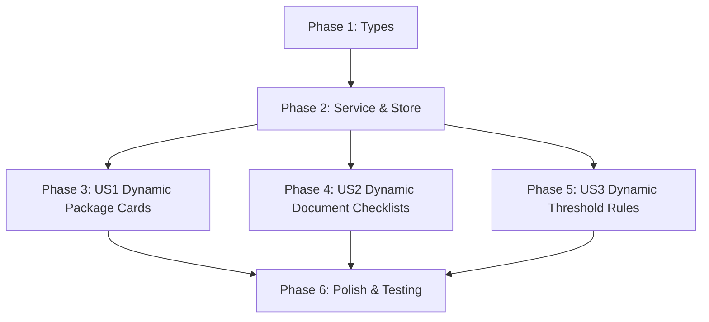

# Tasks: Frontend Master Data Paket Sarpras Integration

**Feature**: `072-master-paket-sarpras-integration` | **Branch**: `072-master-paket-sarpras-integration`
**Spec**: [specs/072-master-paket-sarpras-integration/spec.md](spec.md) | **Plan**: [specs/072-master-paket-sarpras-integration/plan.md](plan.md)

## Phase 1: Setup & Types

- [x] T001 Create TypeScript interfaces and types for master sarpras in `src/types/masterSarpras.ts`

## Phase 2: Foundational Service & Store

- [x] T002 Implement Axios HTTP service client in `src/services/masterSarpras.service.ts`
- [x] T003 Implement Pinia store with caching, getters, and static fallbacks in `src/stores/masterSarpras.ts`

## Phase 3: User Story 1 (P1) - Dynamic Package Selection & Categories

**Goal**: Render package cards and cascading dropdown options dynamically from the backend master data.
**Independent Test**: Load `/pengusulan/baru` Step 1 and verify 13 package cards load with accurate names, icons, labels, and descriptions.

- [x] T004 [US1] Update package selection cards to consume `masterSarprasStore` in `src/views/pengusulan/StepPaketSarpras.vue`
- [x] T005 [P] [US1] Update cascading package select dropdown in `src/components/ui/CascadingPaketSelect.vue`

## Phase 4: User Story 2 (P1) - Dynamic Document Checklists

**Goal**: Fetch and render package document requirements dynamically in proposal draft and verification views.
**Independent Test**: Select `UPH_MULTI_JENIS` and confirm 18 requirement items appear with download template links.

- [x] T006 [US2] Update proposal draft document resolving logic to use `masterSarprasStore` in `src/stores/pengusulanDraft.ts` and `src/lib/pengusulan-persyaratan.config.ts`
- [x] T007 [P] [US2] Ensure verification views use dynamic document checklist in `src/views/dinas/kabupaten/StepSummaryDanSubmit.vue` and `src/views/dinas/provinsi/StepSummaryDanSubmit.vue`

## Phase 5: User Story 3 (P1) - Dynamic Minimum Rule Validation

**Goal**: Validate farmer count and acreage threshold dynamically using backend rules per package.
**Independent Test**: Select `PIKAP` and select 10 farmers (2 Ha) -> verify error banner states 15 farmers and 8 Ha deficit.

- [x] T008 [US3] Integrate dynamic minimum rules from `masterSarprasStore` into Step 3 validation in `src/stores/pengusulanDraft.ts`

## Phase 6: Polish & Verification

- [x] T009 [P] Write unit tests for master sarpras store and service in `src/stores/masterSarpras.test.ts`
- [x] T010 Execute TypeScript typecheck and test verification (`npm run test`)

---

## Dependencies & Execution Order

## Parallel Execution Opportunities

- T004 and T005 can be updated in parallel once T003 is complete.
- T007 (Verification views) can be executed in parallel with T006.
- T009 (Unit tests) can be written in parallel with Phase 4/5 integration.
