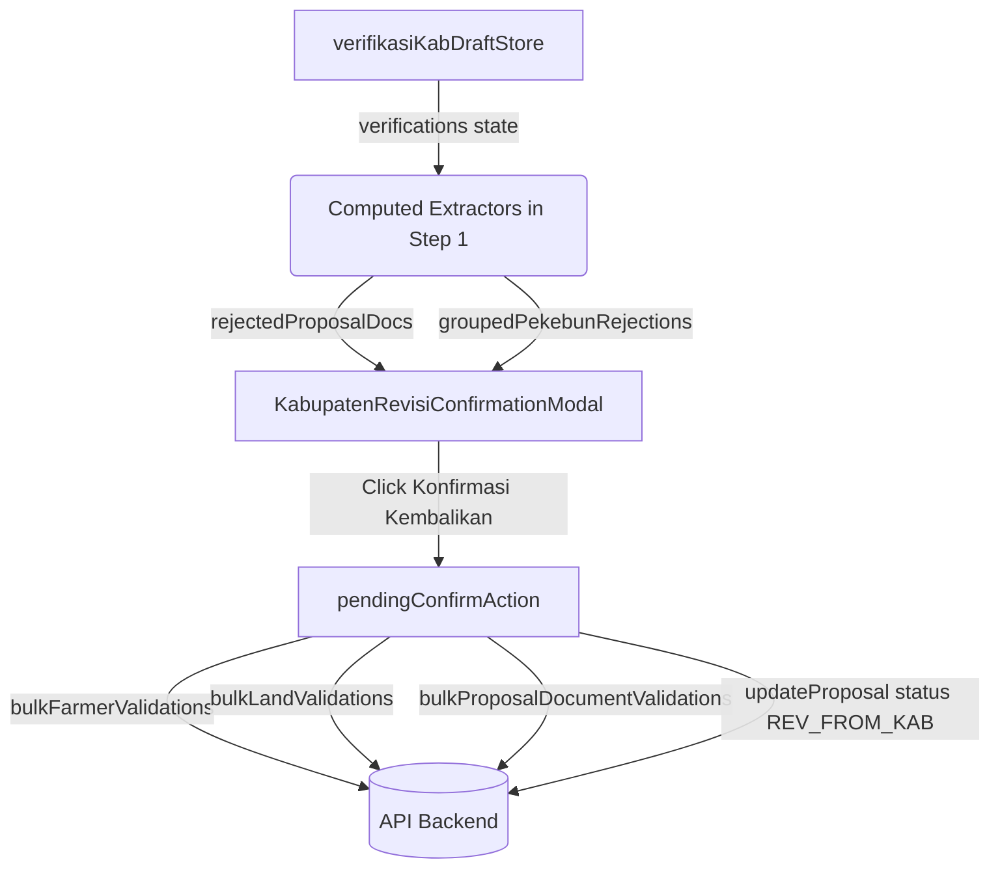

# Phase 1 Data Model: Kabupaten Rejection Confirmation

## 1. Type Definitions

```typescript
export interface RejectedProposalDocItem {
  id?: string | number;
  name: string;
  notes: string;
}

export interface RejectedPekebunDetailItem {
  key: string;
  docTypeOrField: string;
  notes: string;
}

export interface GroupedPekebunRejection {
  pekebunId: string | number;
  namaPekebun: string;
  nik?: string;
  items: RejectedPekebunDetailItem[];
}

export interface KabupatenRejectionModalProps {
  isOpen: boolean;
  isSubmitting?: boolean;
  proposalNumber?: string;
  lembagaName?: string;
  destinationStage?: string; // Default: 'Pemohon (Revisi)'
  rejectedProposalDocs: RejectedProposalDocItem[];
  groupedPekebunRejections: GroupedPekebunRejection[];
}
```

## 2. State & Data Flow


