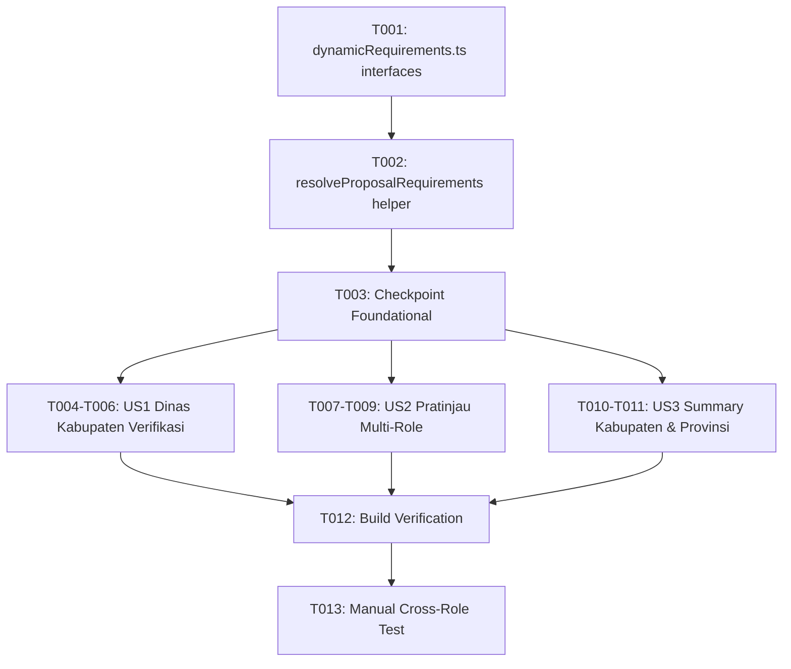

# Tasks: Standarisasi Dokumen Persyaratan Dinamis Master Paket Lintas Role

**Input**: Design documents from `specs/077-dynamic-package-document-requirements/`

**Prerequisites**: plan.md (required), spec.md (required for user stories), research.md, data-model.md, quickstart.md

**Tests**: Unit tests are explicitly omitted per Constitution Development & Quality Workflow (Principle X & Governance). Correctness is verified via TypeScript strict-mode type safety (`npm run build`) and manual workflow verification.

**Organization**: Tasks are grouped by user story to enable independent implementation and testing of each story.

## Format: `[ID] [P?] [Story] Description`

- **[P]**: Can run in parallel (different files, no dependencies)
- **[Story]**: Which user story this task belongs to (e.g., US1, US2, US3)
- Include exact file paths in descriptions

---

## Phase 1: Setup & Shared Infrastructure

**Purpose**: Membuat modul helper terpusat untuk mapping dinamis antara Master Paket Dokumen dan berkas terunggah proposal dengan strategi Union.

- [x] T001 Create unified interface `UnifiedProposalDocItem` and normalization helpers in `src/lib/dynamicRequirements.ts`
- [x] T002 Implement `resolveProposalRequirements(paketCode, proposalDocs, masterStore)` in `src/lib/dynamicRequirements.ts` featuring the Union Strategy (Master + Extra attached documents) with fallback to `PAKET_PERSYARATAN_CONFIG`

---

## Phase 2: Foundational (Blocking Prerequisites)

**Purpose**: Verifikasi kesiapan helper dan caching store sebelum diintegrasikan ke halaman-halaman verifikasi.

- [x] T003 Export and test resolver functions in `src/lib/dynamicRequirements.ts` with mock proposal data and verify fallback behavior

**Checkpoint**: Modul helper siap dipakai di view Kabupaten, Provinsi, Ditjenbun, dan BPDP.

---

## Phase 3: User Story 1 - Verifikasi Dokumen Usulan Dinamis di Dinas Kabupaten (Priority: P1) 🎯 MVP

**Goal**: Memastikan halaman verifikasi Dinas Kabupaten menampilkan dokumen usulan pemohon secara dinamis dari master paket terkait dengan mempertahankan seluruh kontrol verifikasi (Sesuai/Tolak dan Catatan).

**Independent Test**: Masuk ke Dinas Kabupaten (`/dinas/kabupaten/verifikasi/:id`). Buka Step 2 (Verifikasi Pekebun & Dokumen). Verifikasi daftar dokumen usulan berasal dari `masterStore.fetchPersyaratan(paketCode)`, file terunggah terpetakan dengan benar, dan radio status Sesuai/Tolak + Catatan berfungsi normal.

### Implementation for User Story 1

- [x] T004 [US1] Integrate `masterStore.fetchPersyaratan` and `resolveProposalRequirements` in `src/views/dinas/kabupaten/StepVerifikasiPekebunDanDokumenProposal.vue`
- [x] T005 [US1] Update `currentPersyaratan` computed list to use resolved dynamic requirements with union support in `src/views/dinas/kabupaten/StepVerifikasiPekebunDanDokumenProposal.vue`
- [x] T006 [US1] Ensure validation synchronization (radio buttons, rejection modal payload, and note inputs) works seamlessly with dynamic document IDs in `src/views/dinas/kabupaten/StepVerifikasiPekebunDanDokumenProposal.vue`

**Checkpoint**: User Story 1 selesai. Dinas Kabupaten memverifikasi dokumen berdasarkan master dinamis secara end-to-end.

---

## Phase 4: User Story 2 - Pratinjau Dokumen Dinamis pada Tab Pratinjau Multi-Role (Priority: P2)

**Goal**: Menyelaraskan komponen tab pratinjau bersama (`PratinjauPekebunDanDokumenProposal.vue`) yang dipakai di Provinsi, Ditjenbun, dan BPDP agar menampilkan berkas pemohon secara dinamis dari master paket.

**Independent Test**: Buka rincian proposal pada akun Dinas Provinsi, Ditjenbun, atau BPDP. Buka tab "Pratinjau Dokumen Usulan". Pastikan checklist dokumen pemohon sinkron dengan master paket dan berkas dapat dipratinjau dengan modal.

### Implementation for User Story 2

- [x] T007 [US2] Integrate dynamic requirements resolver in `src/components/verification/PratinjauPekebunDanDokumenProposal.vue`
- [x] T008 [US2] Update template loop to render resolved dynamic requirements (including badge status wajib/opsional and extra documents) in `src/components/verification/PratinjauPekebunDanDokumenProposal.vue`
- [x] T009 [US2] Verify document preview modal and download action bindings for dynamic documents in `src/components/verification/PratinjauPekebunDanDokumenProposal.vue`

**Checkpoint**: User Story 2 selesai. Seluruh role penelaah (Provinsi, Ditjenbun, BPDP) melihat dokumen usulan yang konsisten dengan master paket.

---

## Phase 5: User Story 3 - Sinkronisasi Ringkasan Proposal Kabupaten & Provinsi (Priority: P3)

**Goal**: Memastikan tabel ringkasan berkas sebelum submit pada Kabupaten dan Provinsi menggunakan daftar dinamis master paket.

**Independent Test**: Buka Step Summary di Kabupaten dan Provinsi (`StepSummaryDanSubmit.vue`). Pastikan tabel rekapitulasi dokumen menampilkan berkas sesuai master paket dinamis.

### Implementation for User Story 3

- [x] T010 [P] [US3] Update document summary list to use dynamic requirements in `src/views/dinas/kabupaten/StepSummaryDanSubmit.vue`
- [x] T011 [P] [US3] Update document summary list to use dynamic requirements in `src/views/dinas/provinsi/StepSummaryDanSubmit.vue`

**Checkpoint**: User Story 3 selesai. Tahap ringkasan dan submit proposal sepenuhnya sinkron dengan master paket.

---

## Phase 6: Polish & Verification

**Purpose**: Verifikasi kualitas menyeluruh, type checking, dan pengujian lintas role.

- [x] T012 Run `npm run build` in `bpdp-sarpras-kelapa-fe` to verify strict TypeScript compilation and 0 bundling errors
- [x] T013 Perform manual workflow verification across Dinas Kabupaten, Provinsi, Ditjenbun, and BPDP using running dev server

---

## Dependencies & Sequencing

