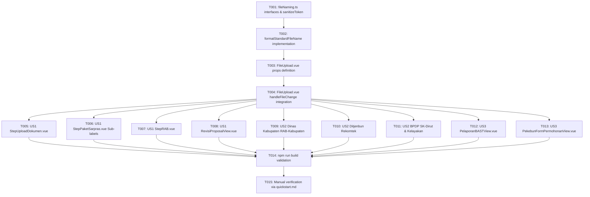

# Tasks: Standardized Auto-Rename for File Uploads

**Input**: Design documents from `specs/078-auto-rename-upload-file/`

**Prerequisites**: plan.md (required), spec.md (required for user stories), research.md, data-model.md, contracts/, quickstart.md

**Tests**: Unit tests are explicitly omitted per Constitution Development & Quality Workflow (Principle X & Governance). Correctness is verified via TypeScript strict-mode type safety (`npm run build`) and manual workflow verification following `quickstart.md`.

**Organization**: Tasks are grouped by user story to enable independent implementation and testing of each story.

## Format: `[ID] [P?] [Story] Description`

- **[P]**: Can run in parallel (different files, no dependencies)
- **[Story]**: Which user story this task belongs to (e.g., US1, US2, US3)
- Include exact file paths in descriptions

---

## Phase 1: Setup & Core Utility Layer

**Purpose**: Membuat modul utilitas terpusat untuk sanitasi string dan perumusan nama berkas standar sesuai formula `[Nama-File]_[No-Proposal]_[Nama-Kelembagaan].[ext]`.

- [x] T001 Create interfaces `FileNamingContext`, `StandardizedFileResult` and sanitization helper `sanitizeToken` in `src/utils/fileNaming.ts`
- [x] T002 Implement `formatStandardFileName(file, context)` in `src/utils/fileNaming.ts` supporting `DRAFT` fallback, multi-file sub-labels, safe character limits, and lowercase extension preservation

---

## Phase 2: Foundational (UI Component Layer)

**Purpose**: Mengintegrasikan dukungan auto-rename dan pratinjau nama standar pada komponen dasar `FileUpload.vue`.

- [x] T003 Update props definition in `src/components/ui/FileUpload.vue` to accept `documentLabel`, `subLabel`, `proposalNumber`, `institutionName`, and `autoRename`
- [x] T004 Update `handleFileChange` in `src/components/ui/FileUpload.vue` to execute `formatStandardFileName`, display the standardized filename in the upload preview card (with mobile-responsive text truncation), and emit the reconstructed `File` object

**Checkpoint**: Komponen `FileUpload.vue` dan utilitas `fileNaming.ts` siap digunakan di seluruh halaman dan alur pengunggahan berkas.

---

## Phase 3: User Story 1 - Pemohon Mengunggah Dokumen Usulan & Revisi (Priority: P1) 🎯 MVP

**Goal**: Berkas yang diunggah oleh Pemohon (KTP, KK, Proposal Usulan, Akta Lembaga, Foto Gudang, RAB Usulan, dan berkas revisi) secara otomatis di-rename saat dipilih/diunggah.

**Independent Test**: Masuk sebagai Pemohon (Kelembagaan Pekebun). Pilih berkas sembarang pada langkah pengunggahan dokumen usulan atau revisi usulan. Amati kartu pratinjau menampilkan nama standar `[Nama-File]_[No-Proposal]_[Nama-Kelembagaan].[ext]` (atau `DRAFT` jika belum terbit nomor proposal), dan verifikasi payload upload membawa nama baru tersebut.

### Implementation for User Story 1

- [x] T005 [P] [US1] Pass `documentLabel` and kelembagaan context to `FileUpload` components (KTP, KK, PROPOSAL, AKTA_LEMBAGA) in `src/views/pengusulan/StepUploadDokumen.vue`
- [x] T006 [P] [US1] Pass `documentLabel="Foto-Gudang"` with `subLabel="Depan"` and `subLabel="Dalam"` to `FileUpload` in `src/views/pengusulan/StepPaketSarpras.vue`
- [x] T007 [P] [US1] Pass `documentLabel="RAB-Usulan"` and proposal context to `FileUpload` in `src/views/pengusulan/StepRAB.vue`
- [x] T008 [US1] Apply `formatStandardFileName` in `handleFileUpload` in `src/views/pemohon/RevisiProposalView.vue` for re-uploaded revision documents and revision RAB

**Checkpoint**: User Story 1 selesai. Seluruh dokumen pemohon ter-rename secara otomatis dan seragam pada saat diunggah.

---

## Phase 4: User Story 2 - Verifikator Multi-Tingkat Mengunggah Dokumen Pengesahan (Priority: P2)

**Goal**: Berkas resmi bertandatangan (RAB Ditandatangani Kabupaten, Rekomtek Ditjenbun, Kelayakan BPDP, dan SK Dirut) yang diunggah oleh verifikator secara otomatis terstandarisasi.

**Independent Test**: Masuk sebagai Verifikator Dinas Kabupaten, Ditjenbun, atau BPDPKS. Unggah dokumen resmi bertandatangan pada usulan aktif. Pastikan nama berkas yang tampil pada pratinjau dan yang tersimpan di backend mengadopsi format standar `[Nama-File]_[No-Proposal]_[Nama-Kelembagaan].[ext]`.

### Implementation for User Story 2

- [x] T009 [P] [US2] Pass `documentLabel="RAB-Kabupaten"` and proposal context to `FileUpload` in `src/views/dinas/kabupaten/StepVerifikasiPekebunDanDokumenProposal.vue`
- [x] T010 [P] [US2] Pass `documentLabel="Rekomtek"` and proposal context to `FileUpload` in `src/views/ditjenbun/CekiDitjenbunView.vue`
- [x] T011 [P] [US2] Pass `documentLabel="Kelayakan-BPDP"` in `src/views/bpdp/CekiBpdpView.vue` and `documentLabel="SK-Dirut"` in `src/views/bpdp/FinalisasiSkDirutView.vue`

**Checkpoint**: User Story 2 selesai. Seluruh dokumen pengesahan dan verifikasi multi-tingkat memiliki nama berkas yang jelas dan dapat dilacak.

---

## Phase 5: User Story 3 - Penyelenggara Penyaluran Mengunggah BAST & Bukti Serah Terima (Priority: P3)

**Goal**: Berkas bukti serah terima barang (BAST) dan dokumentasi penyaluran barang otomatis terstandarisasi dengan nomor proposal dan nama kelembagaan terkait.

**Independent Test**: Buka modul pelaporan BAST atau formulir penyaluran barang, unggah berkas bukti serah terima, dan verifikasi nama berkas tersimpan dengan format `BAST_SPKA..._Kelembagaan.pdf`.

### Implementation for User Story 3

- [x] T012 [P] [US3] Pass `documentLabel="BAST"` and proposal context to `FileUpload` in `src/views/bpdpks/PelaporanBASTView.vue`
- [x] T013 [P] [US3] Integrate `formatStandardFileName` on file upload in `src/views/penyaluran-barang/PekebunFormPermohonanView.vue`

**Checkpoint**: User Story 3 selesai. Dokumentasi penyaluran dan BAST seragam di seluruh alur serah terima.

---

## Phase 6: Polish & Verification

**Purpose**: Verifikasi integritas kompilasi TypeScript dan pengujian manual lintas alur.

- [x] T014 Run `npm run build` in `bpdp-sarpras-kelapa-fe` to verify strict TypeScript type checking and production bundling
- [x] T015 Execute manual verification test cases following `specs/078-auto-rename-upload-file/quickstart.md` across Pemohon, Verifikator, and Penyaluran flows

---

## Dependencies & Sequencing

---

## Parallel Execution Opportunities

- **Phase 3 (User Story 1)**: T005, T006, dan T007 dapat dikerjakan secara paralel karena berada pada file vue yang berbeda (`StepUploadDokumen.vue`, `StepPaketSarpras.vue`, `StepRAB.vue`).
- **Phase 4 (User Story 2)**: T009, T010, dan T011 dapat dikerjakan secara paralel karena mengonfigurasi view verifikasi independen di Kabupaten, Ditjenbun, dan BPDP.
- **Phase 5 (User Story 3)**: T012 dan T013 dapat dikerjakan secara paralel.

---

## Implementation Strategy & MVP Scope

1. **MVP (P1 Delivery)**: Selesaikan Phase 1, Phase 2, dan Phase 3. Pada titik ini, seluruh alur pengunggahan berkas oleh Pemohon/Kelembagaan (usulan baru, draf, paket gudang, RAB, dan revisi berkas) langsung memiliki penamaan standar `[Nama-File]_[No-Proposal]_[Nama-Kelembagaan].[ext]`.
2. **Incremental Rollout (P2 - Verifikator)**: Tambahkan Phase 4 untuk standarisasi berkas pengesahan bertandatangan (RAB Kabupaten, Rekomtek, SK Dirut).
3. **Completion (P3 - Penyaluran & BAST)**: Tambahkan Phase 5 untuk modul serah terima barang dan BAST.
4. **Final Hardening**: Jalankan Phase 6 (`npm run build` dan validasi end-to-end).
