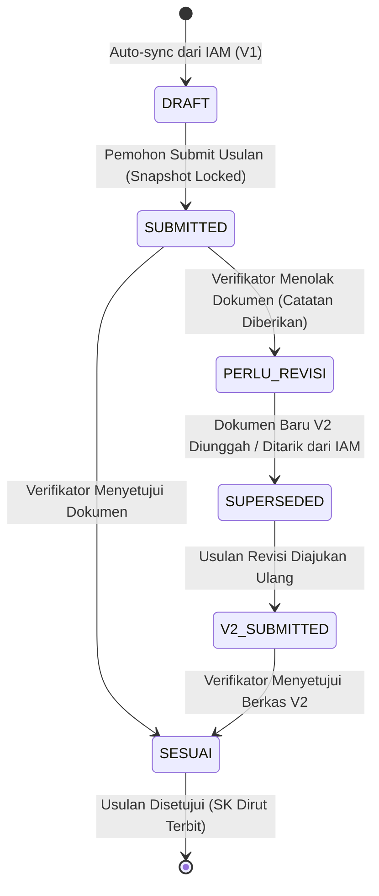

# Data Model: Sinkronisasi Dua Arah Dokumen Legalitas KP dan Surat Penunjukan Ketua (IAM ⇄ Sarpras)

**Feature**: `079-sync-iam-legalitas-dokumen`  
**Date**: 2026-09-09  
**Status**: Complete

---

## 1. Relasi & Arsitektur Data Antar-Layanan

```
┌──────────────────────────────────────────────┐          ┌──────────────────────────────────────────────┐
│           IAM Backend (Master Data)          │          │        Sarpras Backend (Transactional)       │
├──────────────────────────────────────────────┤          ├──────────────────────────────────────────────┤
│  profil_kelembagaan_pekebuns                 │          │  proposals                                   │
│  ├── id (PK)                                 │          │  ├── id (PK)                                 │
│  └── uploads []KelembagaanPekebunUpload      │          │  ├── nomor_proposal                          │
│                                              │          │  └── kelembagaan_id                          │
│  kelembagaan_pekebun_uploads                 │          │                                              │
│  ├── id (PK)                                 │          │  dokumen_proposals                           │
│  ├── upload_name ("legalitas_kp" /           │          │  ├── id (PK)                                 │
│  │                "penunjukan_ketua")        │          │  ├── proposal_id (FK -> proposals.id)       │
│  ├── file_id (FK -> file_uploads.id)         │          │  ├── file_id (FK -> file_uploads.id)         │
│  └── profil_kelembagaan_pekebun_id           │          │  ├── document_type ("AKTA_LEMBAGA", etc.)    │
│                                              │          │  ├── source ("IAM_SYNC" / "MANUAL")          │
│  file_uploads (IAM)                          │          │  ├── version (1, 2, ...)                     │
│  ├── id (PK)                                 │          │  ├── is_active (true/false)                  │
│  ├── original_name                           │          │  └── review_status                           │
│  └── object_key ─────────────────────────────┼────┐     │                                              │
└──────────────────────────────────────────────┘    │     │  file_uploads (Sarpras)                      │
                                                    │     │  ├── id (PK)                                 │
                                                    │     │  ├── original_name (Standardized Sarpras)    │
                                                    └─────┼─▶├── object_key (Sama dengan IAM S3 Key!)    │
                                                          │  └── filesize, extension, content_type       │
                                                          └──────────────────────────────────────────────┘
```

---

## 2. Struktur Tabel & Skema Database

### A. Tabel Sarpras: `dokumen_proposals` (Pembaruan Skema)
Kolom tambahan untuk mendukung *document versioning*, penanda asal sumber, dan audit trail perbaikan:

```sql
ALTER TABLE dokumen_proposals 
ADD COLUMN IF NOT EXISTS source VARCHAR(20) NOT NULL DEFAULT 'MANUAL',
ADD COLUMN IF NOT EXISTS version INT NOT NULL DEFAULT 1,
ADD COLUMN IF NOT EXISTS is_active BOOLEAN NOT NULL DEFAULT TRUE,
ADD COLUMN IF NOT EXISTS review_status VARCHAR(30) NOT NULL DEFAULT 'PENDING',
ADD COLUMN IF NOT EXISTS review_notes TEXT NULL,
ADD COLUMN IF NOT EXISTS replaced_reason VARCHAR(255) NULL;

CREATE INDEX IF NOT EXISTS idx_dokumen_proposals_proposal_active 
ON dokumen_proposals (proposal_id, is_active);

CREATE INDEX IF NOT EXISTS idx_dokumen_proposals_doc_type 
ON dokumen_proposals (proposal_id, document_type, version);
```

### Atribut Tabel `dokumen_proposals`
| Kolom | Tipe Data | Keterangan |
| :--- | :--- | :--- |
| `id` | `BIGSERIAL PRIMARY KEY` | ID unik catatan dokumen proposal |
| `proposal_id` | `BIGINT NOT NULL` | Relasi ke `proposals(id)` ON DELETE CASCADE |
| `file_id` | `BIGINT NOT NULL` | Relasi ke `file_uploads(id)` lokal Sarpras |
| `document_type` | `VARCHAR(50) NOT NULL` | `AKTA_LEMBAGA`, `PENUNJUKAN_KETUA`, `KTP`, `KK`, `PROPOSAL` |
| `source` | `VARCHAR(20) NOT NULL` | `IAM_SYNC` (tersinkronisasi dari IAM) atau `MANUAL` (upload manual) |
| `version` | `INT NOT NULL DEFAULT 1` | Nomor iterasi versi dokumen (V1, V2, V3) |
| `is_active` | `BOOLEAN NOT NULL DEFAULT TRUE` | `true` jika dokumen aktif saat ini; `false` jika telah digantikan/usang (*superseded*) |
| `review_status` | `VARCHAR(30) DEFAULT 'PENDING'` | `PENDING`, `SESUAI`, `PERLU_REVISI`, `SUPERSEDED` |
| `review_notes` | `TEXT NULL` | Catatan penolakan/arahan perbaikan dari verifikator |
| `replaced_reason` | `VARCHAR(255) NULL` | Alasan pembaruan (misal: "Revisi SK Kepengurusan Ketua Baru") |
| `created_at` | `TIMESTAMPTZ DEFAULT NOW()` | Waktu pembuatan dokumen |
| `updated_at` | `TIMESTAMPTZ DEFAULT NOW()` | Waktu pembaruan status |

---

### B. Tabel Sarpras: `sync_outbox_queues` (Resilience & Asynchronous Retry)
Digunakan untuk menampung payload *reverse-sync* ke IAM jika server IAM sedang *downtime/unreachable* saat pemohon melakukan submit revisi:

```sql
CREATE TABLE IF NOT EXISTS sync_outbox_queues (
    id BIGSERIAL PRIMARY KEY,
    target_service VARCHAR(50) NOT NULL DEFAULT 'IAM',
    event_type VARCHAR(100) NOT NULL,
    payload JSONB NOT NULL,
    status VARCHAR(20) NOT NULL DEFAULT 'PENDING',
    retry_count INT NOT NULL DEFAULT 0,
    max_retries INT NOT NULL DEFAULT 5,
    last_error TEXT NULL,
    created_at TIMESTAMPTZ NOT NULL DEFAULT NOW(),
    updated_at TIMESTAMPTZ NOT NULL DEFAULT NOW()
);

CREATE INDEX IF NOT EXISTS idx_sync_outbox_status 
ON sync_outbox_queues (status, retry_count);
```

---

## 3. Data Transfer Objects (DTO) & TypeScript Interfaces

### A. TypeScript Interface (Frontend: `src/types/dokumenSync.ts`)

```typescript
export type DocumentSource = 'IAM_SYNC' | 'MANUAL';
export type DocumentReviewStatus = 'PENDING' | 'SESUAI' | 'PERLU_REVISI' | 'SUPERSEDED';

export interface IamSyncedDocument {
  uploadName: 'legalitas_kp' | 'penunjukan_ketua';
  documentType: 'AKTA_LEMBAGA' | 'PENUNJUKAN_KETUA';
  fileId: number;
  objectKey: string;
  originalName: string;
  filesize: string;
  contentType: string;
  fileUrl?: string; // Presigned URL
  syncedAt: string;
}

export interface ProposalDocumentItem {
  id: number;
  proposalId: number;
  fileId: number;
  documentType: string;
  source: DocumentSource;
  version: number;
  isActive: boolean;
  reviewStatus: DocumentReviewStatus;
  reviewNotes?: string;
  replacedReason?: string;
  fileName: string;
  fileUrl: string;
  fileSize: string;
  contentType: string;
  uploadedAt: string;
}

export interface SyncIamDocumentsResponse {
  kelembagaanId: number;
  institutionName: string;
  documents: IamSyncedDocument[];
}
```

### B. Go Structs (Sarpras Backend & IAM Backend)

```go
package dto

import "time"

// SyncDocumentItem represents an individual document exchanged between services
type SyncDocumentItem struct {
	UploadName   string `json:"upload_name"`   // "legalitas_kp" or "penunjukan_ketua"
	ObjectKey    string `json:"object_key"`    // S3 storage object key
	OriginalName string `json:"original_name"` // e.g. "Akta_Notaris_2026.pdf"
	Filesize     string `json:"filesize"`      // e.g. "1542000"
	ContentType  string `json:"content_type"`  // e.g. "application/pdf"
}

// IamKelembagaanDocumentsResponse is the payload returned by IAM to Sarpras
type IamKelembagaanDocumentsResponse struct {
	KelembagaanID   uint64             `json:"kelembagaan_id"`
	InstitutionName string             `json:"institution_name"`
	Documents       []SyncDocumentItem `json:"documents"`
}

// ReverseSyncRequest is the payload sent from Sarpras to IAM
type ReverseSyncRequest struct {
	SourceService  string             `json:"source_service"`  // "SARPRAS_KELAPA"
	TriggerEvent   string             `json:"trigger_event"`   // "PROPOSAL_REVISION" or "PROPOSAL_SUBMITTED"
	ProposalNumber string             `json:"proposal_number"` // "SPKA109260001"
	SubmittedBy    string             `json:"submitted_by"`    // user identifier
	Documents      []SyncDocumentItem `json:"documents"`
	Timestamp      time.Time          `json:"timestamp"`
}
```

---

## 4. Lifecycle Transisi Status Dokumen (State Machine)


