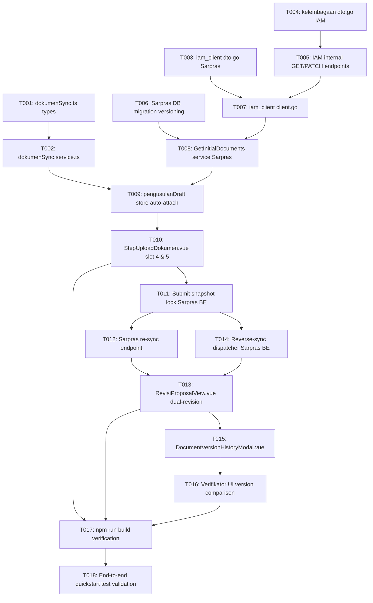

# Tasks: Sinkronisasi Dua Arah Dokumen Legalitas KP dan Surat Penunjukan Ketua (IAM ⇄ Sarpras)

**Input**: Design documents from `specs/079-sync-iam-legalitas-dokumen/`
**Prerequisites**: plan.md (required), spec.md (required), data-model.md, contracts/, quickstart.md

---

## Format: `[ID] [P?] [Story?] Description`

- **[P]**: Dapat dikerjakan secara paralel (file berbeda, tidak ada dependensi langsung)
- **[Story]**: User story terkait (`US1`, `US2`, `US3`)
- Setiap task memuat path file target yang spesifik

---

## Phase 1: Setup & Contracts Layer

**Purpose**: Membangun tipe data, DTO, dan kontrak interface dasar pada kedua layanan dan frontend.

- [x] T001 Create TypeScript types and interfaces `IamSyncedDocument`, `ProposalDocumentItem`, and `DocumentSource` in `src/types/dokumenSync.ts` (`bpdp-sarpras-kelapa-fe`)
- [x] T002 [P] Create API service methods for initial documents fetch and re-sync in `src/services/dokumenSync.service.ts` (`bpdp-sarpras-kelapa-fe`)
- [x] T003 [P] Define DTO structs `SyncDocumentItem`, `IamKelembagaanDocumentsResponse`, and `ReverseSyncRequest` in `internal/iam_client/dto.go` (`bpdp-sarpras-kelapa-be`)
- [x] T004 [P] Define internal request/response DTOs and internal secret verification middleware in `internal/kelembagaan/dto.go` (`bpdp-iam-be`)

---

## Phase 2: Foundational (Backend & Integration Layer)

**Purpose**: Menyiapkan endpoint internal IAM, migrasi database versioning Sarpras, dan IAM Client.

- [x] T005 Implement internal handlers `GET` and `PATCH /api/v1/internal/kelembagaan/:id/documents` with `X-Internal-Secret` auth in `internal/kelembagaan/handler.go`, `service.go`, and `repository.go` (`bpdp-iam-be`)
- [x] T006 [P] Create database migration adding `version`, `source`, `is_active`, `review_status`, `replaced_reason` to `dokumen_proposals` and create `sync_outbox_queues` table in `migrations/` (`bpdp-sarpras-kelapa-be`)
- [x] T007 Implement HTTP `IAMClient` with timeout handling and secret header in `internal/iam_client/client.go` (`bpdp-sarpras-kelapa-be`)
- [x] T008 Implement `GetInitialDocuments` in `internal/proposal/service.go` to fetch IAM metadata, register shared `object_key` into `file_uploads` with standard naming, and generate Presigned URLs (`bpdp-sarpras-kelapa-be`)

---

## Phase 3: User Story 1 - Pemohon Mengajukan Usulan Baru dengan Auto-Attach (Priority: P1) 🎯 MVP

**Goal**: Berkas Akta Legalitas (`AKTA_LEMBAGA`) dan Surat Penunjukan Ketua (`PENUNJUKAN_KETUA`) otomatis terpasang saat pemohon membuka langkah upload dokumen proposal baru tanpa upload fisik.

**Independent Test**: Masuk sebagai Pemohon Kelembagaan Pekebun. Buka langkah upload dokumen pada form pengusulan baru Sarpras. Amati slot 4 (Akta) dan slot 5 (SK Ketua) otomatis berlabel "✓ Terverifikasi dari IAM", tombol pratinjau aktif, dan navigasi ke langkah RAB dapat dilanjutkan tanpa error kelengkapan berkas.

### Implementation for User Story 1

- [x] T009 [P] [US1] Update `src/stores/pengusulanDraft.ts` to call `dokumenSync.service` and populate auto-attached documents for `AKTA_LEMBAGA` and `PENUNJUKAN_KETUA` (`bpdp-sarpras-kelapa-fe`)
- [x] T010 [US1] Update `src/views/pengusulan/StepUploadDokumen.vue` to add slot 4 ("4. Legalitas Kelembagaan / Akta") and dedicated slot 5 ("5. Surat Penunjukan Ketua / SK Pengurus") with auto-detected badge, Presigned URL preview button, and manual fallback dropzone (`bpdp-sarpras-kelapa-fe`)
- [x] T011 [US1] Update proposal submission handler in `internal/proposal/service.go` to lock document snapshot (`is_active = true, status = SUBMITTED`) and sync first-time manual documents to IAM if previously missing (`bpdp-sarpras-kelapa-be`)

---

## Phase 4: User Story 2 - Penanganan Revisi Kedua Dokumen & Reverse-Sync (Priority: P2)

**Goal**: Pemohon dapat memperbarui kedua dokumen secara serentak via sinkronisasi IAM atau upload manual di Sarpras, mencatat riwayat Versi 2, dan menyinkronkan pembaruan kembali ke master IAM.

**Independent Test**: Buat proposal berstatus `REV_FROM_KAB` dengan penolakan pada kedua dokumen. Buka `RevisiProposalView.vue`. Unggah berkas revisi untuk kedua slot, lalu submit. Pastikan Sarpras mencatat kedua dokumen sebagai Versi 2, dan profil master di IAM otomatis terbarui dengan berkas baru tersebut.

### Implementation for User Story 2

- [x] T012 [P] [US2] Implement `POST /api/v1/proposals/:id/re-sync-iam` endpoint in `internal/proposal/handler.go` and `service.go` to fetch latest IAM files and increment document version to V2 (`bpdp-sarpras-kelapa-be`)
- [x] T013 [US2] Update `src/views/pemohon/RevisiProposalView.vue` to provide bulk re-sync button `[ 🔄 Sinkronkan Seluruh Dokumen dari IAM ]`, per-document revision dropzone, and applicant response note field (`bpdp-sarpras-kelapa-fe`)
- [x] T014 [US2] Implement reverse-sync dispatcher in `internal/proposal/service.go` upon revision submission to patch updated `object_key` to IAM with retry queue mechanism (`bpdp-sarpras-kelapa-be`)

---

## Phase 5: User Story 3 - Peninjauan Riwayat Versi Dokumen oleh Verifikator (Priority: P3)

**Goal**: Verifikator Dinas Kabupaten, Ditjenbun, dan BPDPKS dapat melihat berkas versi terbaru, membandingkannya dengan versi lama yang ditolak, dan menyetujui usulan.

**Independent Test**: Masuk sebagai Verifikator Dinas. Buka proposal usulan revisi. Pada tab dokumen, periksa label "Versi 2 (Revisi)", buka tombol "Bandingkan Riwayat Versi 1", dan pastikan berkas baru serta catatan tanggapan pemohon tampil dengan jelas.

### Implementation for User Story 3

- [x] T015 [P] [US3] Create `src/components/pengusulan/DocumentVersionHistoryModal.vue` to display side-by-side comparison of V1 rejected file, rejection notes, V2 new file, and applicant response notes (`bpdp-sarpras-kelapa-fe`)
- [x] T016 [US3] Update `src/views/dinas/kabupaten/StepVerifikasiPekebunDanDokumenProposal.vue` to show version badges, source indicator, and trigger `DocumentVersionHistoryModal.vue` (`bpdp-sarpras-kelapa-fe`)

---

## Phase 6: Polish & Verification

**Purpose**: Verifikasi integritas kompilasi TypeScript dan pengujian skenario menyeluruh lintas layanan.

- [x] T017 Run `npm run build` (`vue-tsc -b && vite build`) in `bpdp-sarpras-kelapa-fe` to verify strict TypeScript type checking and production bundling
- [x] T018 Execute manual verification scenarios per `specs/079-sync-iam-legalitas-dokumen/quickstart.md` across new proposal, dual-document revision, and fallback flows

---

## Dependencies & Sequencing

---

## Parallel Execution Opportunities

- **Phase 1 & 2**: T001, T002, T003, T004, dan T006 dapat dikerjakan secara paralel karena berada di file, paket, dan repositori terpisah (`fe`, `sarpras-be`, `iam-be`).
- **Phase 3 (User Story 1)**: T009 dan T010 dapat dikerjakan bersamaan setelah T002 siap.
- **Phase 4 (User Story 2)**: T012 (backend) dan T013 (frontend) dapat dikerjakan secara paralel.
- **Phase 5 (User Story 3)**: T015 (komponen modal mandiri) dapat dibuat independen sebelum dihubungkan ke T016.
