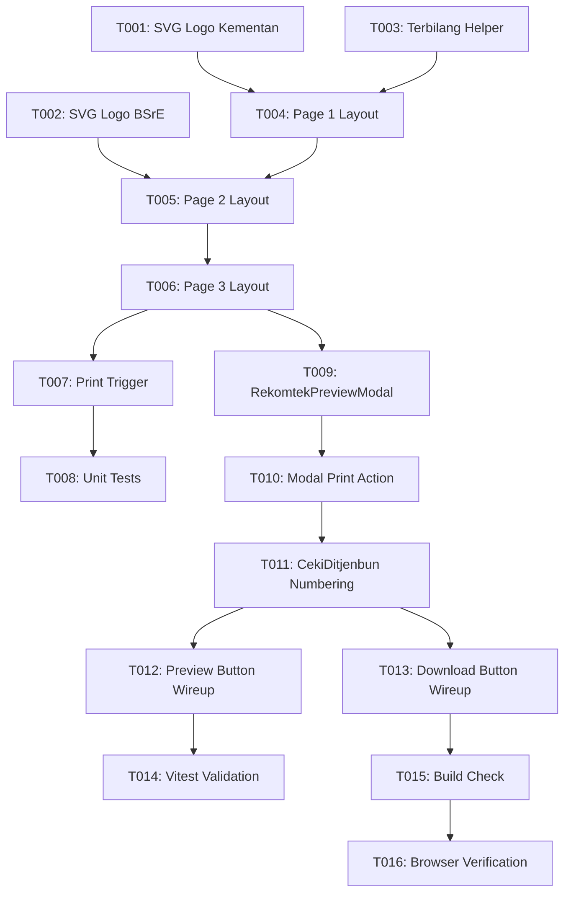

# Tasks: 1:1 Rekomendasi Teknis (Rekomtek) Ditjenbun PDF Generator

**Input**: Design documents from `specs/083-generate-rekomtek-ditjenbun/`  
**Prerequisites**: `spec.md`, `plan.md`, `research.md`, `data-model.md`, `contracts/rekomtek-generator.contract.md`

## Format: `[ID] [P?] [Story] Description`
- **[P]**: Can run in parallel (different files, no dependencies)
- **[Story]**: Which user story this task belongs to (`US1`, `US2`, `US3`)

---

## Phase 1: Setup (Shared Assets)

**Purpose**: Menyiapkan aset vektor resmi logo instansi yang tajam pada resolusi cetak 300+ DPI.

- [x] T001 [P] Create official Kementerian Pertanian vector SVG asset in `src/assets/logo-kementan.svg`
- [x] T002 [P] Create official BSrE BSSN vector SVG asset in `src/assets/logo-bsre.svg`

---

## Phase 2: Foundational (Core PDF & HTML Print Engine)

**Purpose**: Menyediakan engine pembuat HTML 3 halaman A4 presisi 1:1 dan logika pencetakan dokumen.

- [x] T003 Implement terbilang Rupiah conversion helper and currency formatter in `src/utils/rekomtekPdfGenerator.ts`
- [x] T004 Implement Page 1 HTML layout (Kop surat resmi Kementan garis ganda, metadata, tujuan Yth Dirut BPDPKS, 8 butir data usulan & rincian RAB) in `src/utils/rekomtekPdfGenerator.ts`
- [x] T005 Implement Page 2 HTML layout (klausul lanjutan butir 7, paragraf penutup, blok TTE BSrE Plt Dirjenbun Heru Tri Widarto, dan daftar tembusan 6 pihak) in `src/utils/rekomtekPdfGenerator.ts`
- [x] T006 Implement Page 3 HTML layout (Header lampiran surat, data SK CPCL Kabupaten, data Berita Acara verifikasi provinsi, dan blok paraf) in `src/utils/rekomtekPdfGenerator.ts`
- [x] T007 Implement iframe print & PDF trigger function `printRekomtekDocument` in `src/utils/rekomtekPdfGenerator.ts`
- [x] T008 [P] Create unit test suite for document generation in `src/utils/rekomtekPdfGenerator.test.ts`

---

## Phase 3: User Story 1 (P1) - Interactive 1:1 A4 Modal Preview Component

**Purpose**: Verifikator Ditjenbun dapat meninjau tampilan 3 halaman dokumen Rekomtek secara interaktif langsung di layar sebelum mencetak.

- [x] T009 [US1] Create `RekomtekPreviewModal` component with multi-page A4 canvas, zoom controls (50%-150%), and close action in `src/components/ditjenbun/RekomtekPreviewModal.vue`
- [x] T010 [US1] Add print and download action triggers to `RekomtekPreviewModal` in `src/components/ditjenbun/RekomtekPreviewModal.vue`

---

## Phase 4: User Story 2 (P1) - Integration in CekiDitjenbunView with Manual Numbering & Fallback

**Purpose**: Mengintegrasikan tombol aksi draf Rekomtek dan sinkronisasi input nomor surat resmi (Opsi 1).

- [x] T011 [US2] Update `nomorRekomtek` input placeholder and fallback logic (`.../PI.400/E/[BULAN]/[TAHUN]`) in `src/views/ditjenbun/CekiDitjenbunView.vue`
- [x] T012 [US2] Connect preview button (eye icon) to open `RekomtekPreviewModal` with active proposal data in `src/views/ditjenbun/CekiDitjenbunView.vue`
- [x] T013 [US2] Connect "Download Draf Rekomtek" button to invoke `printRekomtekDocument` directly in `src/views/ditjenbun/CekiDitjenbunView.vue`

---

## Phase 5: Polish & Quality Assurance

**Purpose**: Memastikan keandalan kode, validitas tipe TypeScript, dan keselarasan visual 1:1.

- [x] T014 Run Vitest unit tests (`npm run test -- src/utils/rekomtekPdfGenerator.test.ts`) and verify 100% pass
- [x] T015 Run TypeScript build validation (`npm run build`) to ensure 0 compiler/type errors
- [x] T016 Verify visual alignment of 3-page layout against uploaded sample PDF in browser

---

## Dependencies & Completion Order

## Implementation Strategy
1. **MVP**: Fase 1 + Fase 2 + Fase 3 (Generator dokumen + Modal Viewer).
2. **Incremental Delivery**: Integrasikan tombol di `CekiDitjenbunView.vue` (Fase 4).
3. **Verification**: Jalankan unit test dan typecheck (Fase 5).
